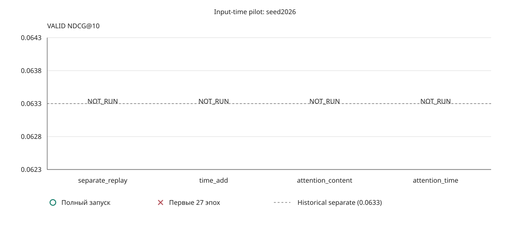

# Причинный входной attention/time адаптер Mamba3

Один seed, exploratory. Replay не независимый seed; без significance/CI и сравнения с внешними paper TEST.

| mode | parameters | VALID NDCG@10 | HR@10 | delta replay | best epoch (0-based) | actual epochs | runtime sec | peak allocated/reserved MiB | status |
|---|---|---|---|---|---|---|---|---|---|
| separate_replay | - | - | - | - | - | - | - | - | NOT_RUN |
| time_add | - | - | - | - | - | - | - | - | NOT_RUN |
| attention_content | - | - | - | - | - | - | - | - | NOT_RUN |
| attention_time | - | - | - | - | - | - | - | - | NOT_RUN |

| mode | первые 27 эпох | полный запуск |
|---|---|---|
| separate_replay | - | - |
| time_add | - | - |
| attention_content | - | - |
| attention_time | - | - |
| historical separate2026 | 0.0614 | 0.0633 |

Неполные/ошибочные runs: победитель не выбирается.

TEST=0. Численные различия не доказывают семантические режимы или новизну.

[JSON и hashes](pilot_summary.json)

- [mamba3_input_separate_replay_seed2026_001](mamba3_input_separate_replay_seed2026_001.json), SHA256 `aa27df93a7558f28d68a7443c88875544eafce412192dc0df6b93ec7f35cf9f3`
- [mamba3_input_time_add_seed2026_001](mamba3_input_time_add_seed2026_001.json), SHA256 `aeed0c8ea3a2af2b063ae297f4a43ed6e2f17a62331e05255c53603e015cc6f7`
- [mamba3_input_attention_content_seed2026_001](mamba3_input_attention_content_seed2026_001.json), SHA256 `8143a705d16133b83820026e5f4170d5decfec745aa0f97c1a9190314acc1341`
- [mamba3_input_attention_time_seed2026_001](mamba3_input_attention_time_seed2026_001.json), SHA256 `144dd28fd0c86673190771315fd13783b7029579904ddbf990bdccf2b850294d`

