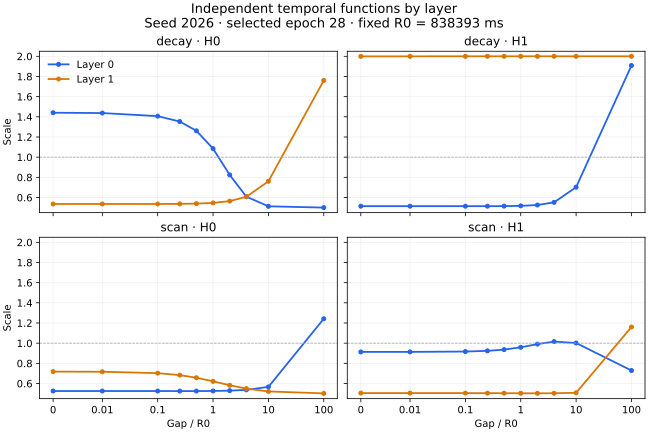

# Временные функции отдельно по слоям: пилот seed2026

**COMPLETE.** Независимые функции дали VALID NDCG@10 **0.0625** против **0.0633** у общих: **Δ −0.0008 (−1.2638%)**. Пункт 4 проверен на одном paired seed. Рабочая основа остаётся MIMO dual fixed-reference с общими функциями двух слоёв. Подтверждающая серия не рекомендована по этому результату.

## Постановка

Изменено только разделение параметров временных функций между двумя слоями. `shared_layers` использует одни decay/scan calibrators для обоих слоёв (715020 параметров). `layer_specific` добавляет независимую копию через `deepcopy` (715152 параметра, +132). Четыре calibrators по 66 параметров: decay и scan каждого слоя; каждый выдаёт две head scales. Начальные значения копий равны, storage независим, дополнительных RNG draws нет.

В обоих вариантах MIMO rank4/chunk8, 2 слоя, 2 temporal heads, history50, fixed R0=838393 мс. Внутри слоя write и phase используют один и тот же scan tensor. Gap вычисляется один раз из history; первое событие и padding нейтральны, реальный zero-gap активен, target timestamp не используется. Kernel math, precision, optimizer и early stopping сохранены. [Замороженный план](study_plan.json), [design](DESIGN.md).

KuaiRand protocol B: 23951 пользователь, 7111 кандидатов, хронологический leave-one-out; TRAIN full softmax, VALID full catalog. Два fresh TRAIN, сначала shared, затем layer-specific, один seed2026. TEST evaluations=0. Primary contrast заранее задан: layer_specific − shared_layers по VALID NDCG@10.

## Результат

| Variant | Parameters | VALID NDCG@10 | HR@10 | First27 NDCG@10 | Best epoch (с 0) | Epochs |
| --- | --- | --- | --- | --- | --- | --- |
| shared_layers | 715020 | 0.0633 | 0.1162 | 0.0620 | 27 | 39 |
| layer_specific | 715152 | 0.0625 | 0.1168 | 0.0619 | 28 | 40 |

Δ NDCG@10 = −0.0008; относительный Δ = −1.2638230648%. HR@10 изменился на +0.0006, но он вторичен. First27 использует только реально наблюдавшиеся эпохи 0–26: Δ = −0.0001, направление совпадает с полным run. Оба обучения завершены по неизменённому early stopping; при равенстве лучшей метрики выбирается последняя такая эпоха.

| Variant | K | HR | Recall | NDCG |
|---|---:|---:|---:|---:|
| shared_layers | 5 | 0.0712 | 0.0712 | 0.0488 |
| shared_layers | 10 | 0.1162 | 0.1162 | 0.0633 |
| shared_layers | 20 | 0.1865 | 0.1865 | 0.0809 |
| shared_layers | 50 | 0.3338 | 0.3338 | 0.1100 |
| layer_specific | 5 | 0.0688 | 0.0688 | 0.0471 |
| layer_specific | 10 | 0.1168 | 0.1168 | 0.0625 |
| layer_specific | 20 | 0.1885 | 0.1885 | 0.0805 |
| layer_specific | 50 | 0.3330 | 0.3330 | 0.1090 |

## Время и память

| Variant | TRAIN s | VALID s | Peak allocated bytes | Peak reserved bytes |
| --- | --- | --- | --- | --- |
| shared_layers | 930.762166 | 51.632619 | 3024827392 | 4076863488 |
| layer_specific | 876.968763 | 24.882275 | 3056789504 | 4114612224 |

Это описательные значения конкретных запусков. Разное число эпох, JIT и состояние кешей не позволяют считать это честным сравнением скорости.

## Диагностика выбранного checkpoint

Ниже функции `layer_specific` на best epoch 28; shared control выбран на epoch 27. Значения сохранены во время обучения, при публикации новые model/data forwards не выполнялись. Сетка была зафиксирована до fit: g/R0 = 0, 0.01, 0.1, 0.25, 0.5, 1, 2, 4, 10, 100. Здесь zero-gap активен. Числа округлены до 6 знаков только для таблиц; полная точность находится в [raw JSON](runs/attempt_001/mamba3_layer_temporal_layer_specific_seed2026_001.json).

### decay

| g/R0 | Layer0 H0 | Layer0 H1 | Layer1 H0 | Layer1 H1 |
| --- | --- | --- | --- | --- |
| 0 | 1.440590 | 0.514075 | 0.535823 | 1.999639 |
| 0.01 | 1.437281 | 0.514054 | 0.535825 | 1.999658 |
| 0.1 | 1.406672 | 0.513952 | 0.536037 | 1.999782 |
| 0.25 | 1.353225 | 0.514056 | 0.536973 | 1.999890 |
| 0.5 | 1.261202 | 0.514741 | 0.539529 | 1.999959 |
| 1 | 1.084672 | 0.517302 | 0.546595 | 1.999992 |
| 2 | 0.824065 | 0.525543 | 0.564435 | 1.999999 |
| 4 | 0.608045 | 0.552197 | 0.607547 | 2.000000 |
| 10 | 0.512868 | 0.702585 | 0.760913 | 2.000000 |
| 100 | 0.500022 | 1.908612 | 1.760691 | 2.000000 |

### scan

| g/R0 | Layer0 H0 | Layer0 H1 | Layer1 H0 | Layer1 H1 |
| --- | --- | --- | --- | --- |
| 0 | 0.525611 | 0.913148 | 0.718133 | 0.505239 |
| 0.01 | 0.525569 | 0.913482 | 0.716506 | 0.505191 |
| 0.1 | 0.525273 | 0.916913 | 0.702796 | 0.504807 |
| 0.25 | 0.525043 | 0.923732 | 0.683173 | 0.504321 |
| 0.5 | 0.525109 | 0.936099 | 0.657264 | 0.503786 |
| 1 | 0.526062 | 0.959009 | 0.621725 | 0.503244 |
| 2 | 0.529184 | 0.990554 | 0.582681 | 0.502979 |
| 4 | 0.537046 | 1.015694 | 0.549327 | 0.503451 |
| 10 | 0.566396 | 1.001547 | 0.521513 | 0.507760 |
| 100 | 1.242018 | 0.728593 | 0.502031 | 1.160185 |

### Значения при gap = R0

| Layer | Mechanism | H0 | H1 |
| --- | --- | --- | --- |
| 0 | decay | 1.084672 | 0.517302 |
| 0 | scan | 0.526062 | 0.959009 |
| 1 | decay | 0.546595 | 1.999992 |
| 1 | scan | 0.621725 | 0.503244 |

### Различие функций

Для каждого head показаны mean и max по десяти точкам сетки от `abs(log(scale_layer0 / scale_layer1))`. Это описательные показатели, а не метрики качества.

| Mechanism | Head | Mean abs log-ratio | Max abs log-ratio |
| --- | --- | --- | --- |
| decay | H0 | 0.743178 | 1.258809 |
| decay | H1 | 1.185980 | 1.358663 |
| scan | H0 | 0.267528 | 0.905831 |
| scan | H1 | 0.617470 | 0.701841 |

### Различие параметров

L2 = norm(layer0 − layer1); relative L2 = L2 / norm(layer0), null при нулевой норме. Определение зафиксировано до fit. Для объединённых параметров norm(layer0) равна 5.035254 (decay) и 4.499290 (scan).

| Mechanism | Parameter | L2 | Relative L2 |
| --- | --- | --- | --- |
| decay | first.weight | 0.430204 | 0.143176 |
| decay | first.bias | 0.442410 | 0.122175 |
| decay | last.weight | 3.983979 | 2.296909 |
| decay | last.bias | 1.106703 | 2.447315 |
| decay | all | 4.180632 | 0.830272 |
| scan | first.weight | 1.526476 | 0.620391 |
| scan | first.bias | 0.614593 | 0.178442 |
| scan | last.weight | 2.534429 | 1.710084 |
| scan | last.bias | 0.472732 | 1.309319 |
| scan | all | 3.058539 | 0.679783 |

В shared control функции обоих слоёв совпадают, все перечисленные меры расхождения равны нулю. Нормы treatment сохранены при fit и связаны с выбранной эпохой через checkpoint metadata. При terminal audit проверена их алгебраическая согласованность; пересчёта из весов не было.

### Близость к границам

Доли точек диагностической сетки с scale < 0.51 и scale > 1.99. Это доли десяти grid points, не доли событий датасета.

| Layer | Mechanism | Head | Near lower | Near upper |
| --- | --- | --- | --- | --- |
| 0 | decay | H0 | 0.100000 | 0.000000 |
| 0 | decay | H1 | 0.000000 | 0.000000 |
| 0 | scan | H0 | 0.000000 | 0.000000 |
| 0 | scan | H1 | 0.000000 | 0.000000 |
| 1 | decay | H0 | 0.000000 | 0.000000 |
| 1 | decay | H1 | 0.000000 | 1.000000 |
| 1 | scan | H0 | 0.100000 | 0.000000 |
| 1 | scan | H1 | 0.900000 | 0.000000 |

Функции действительно разошлись. У layer1 decay H1 все точки близки к верхней границе, scan H1 — 9 из 10 к нижней. Это не обосновывает роли «короткие/долгие интересы» или «локальный/глобальный слой». Диапазон scales и настройки по результату не менялись.

## Проверки и происхождение

- CPU: 28/28 PASS в обычной среде и 28/28 PASS без Git; failures/errors/skipped=0, CUDA не инициализирована. Проверены counts, independent storage, initialization/RNG, routing/masks, dual tensor identity, chain rule, gradcheck, state_dict roundtrip и frozen settings.
- Targeted GPU gate: 6 cases / 214 checks PASS. Shared output/loss/gradients воспроизвели исторический implementation; layer-specific init output bitwise equal. Проверены common gradients и shared temporal gradient ≈ sum двух layer gradients, в том числе при nonzero tied weights; вмешательства в отдельные слои, causality, user isolation, masks, zero-gap и roundtrip. Допуски не менялись.
- Smoke: оба варианта, по 3 synthetic Adam steps, batch2048/history50/kernel56; finite loss/gradients и roundtrip PASS. Восемь corresponding parameter tensors temporal sets разошлись после шагов. Smoke не входит в scientific fit count.
- Старые MIMO kernel checks 45 cases / 2342 checks унаследованы по точным SHA; математическое ядро не менялось.
- Fresh shared replay: все 39 epoch metrics, train losses, diagnostics исторического control, best epoch, actual epochs и checkpoint SHA совпали с MIMO dual seed2026 job4358147. Timing/memory из exact replay исключены.
- Внутри новой пары совпали initial common backbone, обе исходные temporal copies, Python/NumPy/CPU/CUDA/DataLoader RNG, first consumed batch, data/split hashes, config (кроме sharing/output paths), precision и Adam settings. Dropout RNG parity проверена в synthetic setup; независимый полный per-step dropout trace scientific fits не записывался.
- Terminal audit: все 39 сохранённых файлов / 1 991 469 bytes проверены по SHA/bytes; 381 source file сверён с execution Git blobs. 79 epochs / 948 metric cells и округлённые log losses сверены с двумя логами. Проверены last-tie selection, early stop, first27, admission/ownership, metadata, checkpoint SHA и пересчитанный summary. Runtime errors/NaN/Inf не обнаружены; в логах только прежние pandas/AMP FutureWarning.

При stdlib-пересчёте float64 диагностических reductions 140 значений отличаются от Torch не более чем на 8.89e−16 (включая 14 дробей границ с округлением в 1 ULP). Эти различия явно сохранены в аудите; raw values, scientific metrics и GPU tolerance policy не изменены.

Job **4372822**, **COMPLETED 0:0**, **cn-045**, **00:38:50**. Старт 2026-10-03 13:51:11 MSK, завершение 14:30:01 MSK. Одна A100, rocky/proj_1833/type_e, CPU4, mem0, limit06:00:00, no-requeue.

- Execution commit: `30640e2be36b45c6f89e31f91aae83f76f2d2254`.
- Source hash: `ad71e91b271db416cf05717e03d7429c60d39657216d1cf18275465ed1500e5b` (381 files).
- Preservation commit: `a44fd9e43b09fdf3a64d03116dc4556629bbfd13`.
- Реестр: фактически 120 → 122 записи; добавлены ровно два fresh fit, прежний prefix byte-identical. Исторический replay не считается новым независимым seed.

Checkpoint weights оставлены на кластере. Пути относительно `/home/daryumin/iberdov/diplom/experiments/mamba3_layer_temporal/`:

- **shared_layers**: `slurm_logs/attempt_001/mamba3_layer_temporal_shared_layers_seed2026_001/checkpoints/best_state_dict.pth`, 2507332 bytes; SHA256 `cba3da6aa7daf883cf9bcddb1b92540d48c26c62d797f8c9a1b602bcea292db8`.
- **layer_specific**: `slurm_logs/attempt_001/mamba3_layer_temporal_layer_specific_seed2026_001/checkpoints/best_state_dict.pth`, 2511462 bytes; SHA256 `c005f303f2f863fceed1a4db9d4e1f771600c5f2456d10e9636bf2633670ee6d`.

[Summary](runs/attempt_001/pilot_summary.json) · [shared raw](runs/attempt_001/mamba3_layer_temporal_shared_layers_seed2026_001.json) · [layer-specific raw](runs/attempt_001/mamba3_layer_temporal_layer_specific_seed2026_001.json) · [gate](runs/attempt_001/targeted_gate.json) · [smoke](runs/attempt_001/smoke.json) · [preservation](evidence/job4372822/preservation_manifest.json) · [audit](evidence/job4372822/independent_audit.json) · [scheduler](evidence/job4372822/scheduler_terminal.json).

## Вывод

Отдельные temporal functions не улучшили primary NDCG@10 на этой паре: −0.0008 (−1.2638%). First27 согласуется с направлением полного результата. Функции и параметры разошлись, поэтому отрицательный результат не объясняется сохранением идентичных temporal sets. На одном seed это не доказывает общий вред или отсутствие возможного эффекта, но основания запускать confirmation по данному pilot нет.

Пункт 4 завершён в pilot scope. Сохраняется provisional backbone MIMO dual fixed-reference с shared temporal functions. Пункт 5 — отдельная гипотеза: этот результат сам по себе не даёт оснований добавлять explicit time-addressed memory. Сначала нужна самостоятельная проверяемая мотивация для неё; реализация, проектирование кода и запуск пункта 5 здесь не выполнялись. TEST, post-hoc tuning, новые variants, confirmation, article/Overleaf edits не выполнялись.
