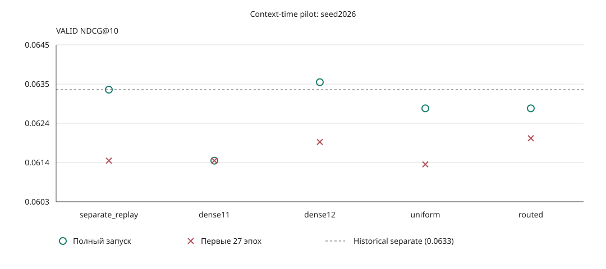
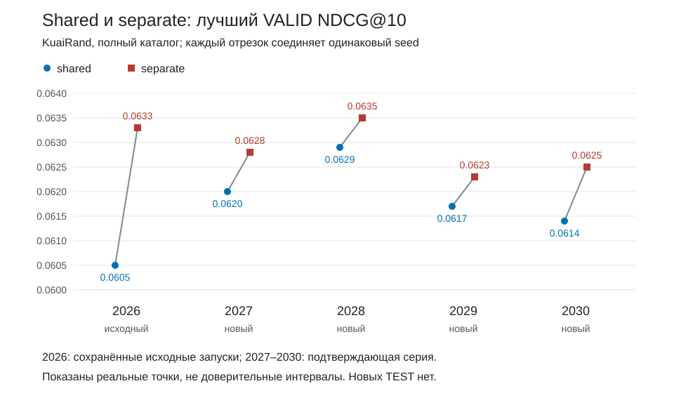
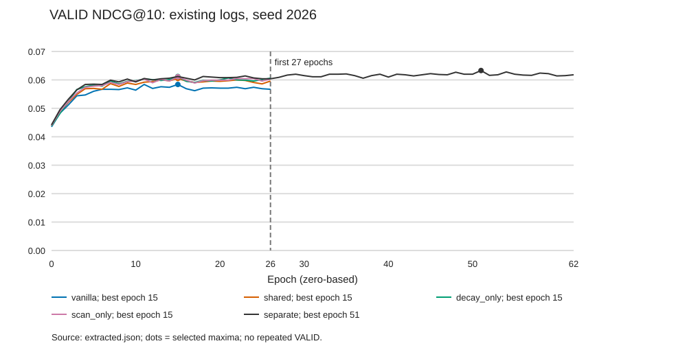
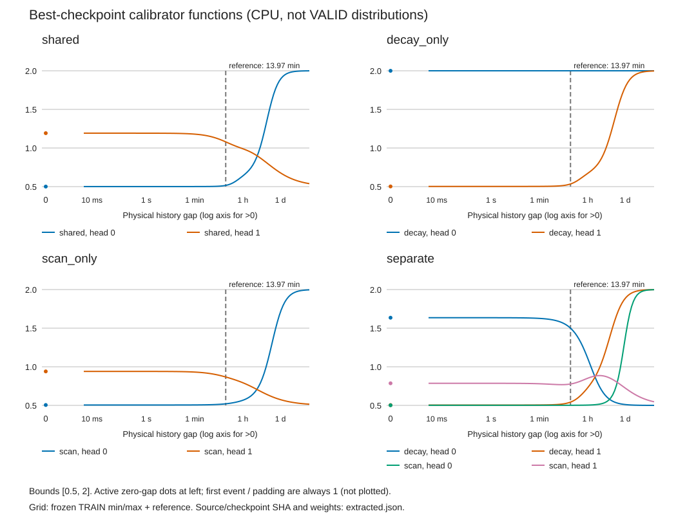

# Mamba3: результаты временных механизмов

<a id="context-time-pilot"></a>

## Контекстная калибровка и временные эксперты: первый эксперимент

Проверили, помогает ли учитывать контекст исторического видео при дополнительной калибровке времени и нужна ли для этого экспертная факторизация. Пять вариантов обучены с нуля на seed2026 с одинаковыми правилами обучения и выбора checkpoint по **VALID NDCG@10**, на том же хронологическом разбиении KuaiRand с полным каталогом. Основной comparator здесь **separate_replay** этого эксперимента, не среднее пятисидовой серии и не опубликованный TiM4Rec TEST.

Это **не четыре MLP после итогового h**: четыре пары экспертов предлагают функции исторического интервала для внутренних decay/scan scales. Router видит embedding текущего исторического видео и gap, но не весь user state, target или t_score; он смешивает ограниченные log-scales до экспоненты. Uniform использует равные веса, dense11/dense12 являются обычными сетями по тем же входам без MoE; изменение DT затрагивает phase и input weighting, не только периодичность. [Формулы, входы и фиксированные настройки](../experiments/mamba3_context_time/README.md).

| Вариант (mode; ссылка на raw JSON) | VALID NDCG@10 | HR@10 | Δ NDCG@10 к separate_replay | Лучший NDCG@10 за первые 27 эпох |
|---|---:|---:|---:|---:|
| Контроль separate ([separate_replay](../experiments/mamba3_context_time/runs/mamba3_context_separate_replay_seed2026_001.json)) | 0.0633 | 0.1176 | 0.0000 | 0.0614 |
| Контекстная сеть, ширина 11 ([dense11](../experiments/mamba3_context_time/runs/mamba3_context_dense11_seed2026_001.json)) | 0.0614 | 0.1124 | -0.0019 | 0.0614 |
| Контекстная сеть, ширина 12 ([dense12](../experiments/mamba3_context_time/runs/mamba3_context_dense12_seed2026_001.json)) | 0.0635 | 0.1177 | +0.0002 | 0.0619 |
| Эксперты с равными весами ([uniform](../experiments/mamba3_context_time/runs/mamba3_context_uniform_seed2026_001.json)) | 0.0628 | 0.1163 | -0.0005 | 0.0613 |
| Эксперты с обучаемым router ([routed](../experiments/mamba3_context_time/runs/mamba3_context_routed_seed2026_001.json)) | 0.0628 | 0.1164 | -0.0005 | 0.0620 |

**Вывод:** в первоначальном сравнении на seed2026 обучаемая маршрутизация временных экспертов не улучшила итоговый VALID NDCG@10. Routed и uniform дали 0.0628 против 0.0633 у separate. Проверенный экспертный вариант пока не включается в основную модель; separate остаётся рабочей основой.

Dense12 получил **0.0635**, то есть **+0.0002, около +0.32%** к replay, но это один seed, без подтверждённого устойчивого превосходства. За первые 27 эпох (индексы 0–26) routed получил **0.0620 против 0.0614** у separate: это дополнительное наблюдение, не замена основного критерия итогового VALID. Равенство routed/uniform относится к NDCG@10 с доступным округлением до четырёх знаков, а не ко всем неокруглённым scores или метрикам.



[SVG](../experiments/mamba3_context_time/runs/pilot_summary.svg) · [Исходная JSON-сводка](../experiments/mamba3_context_time/runs/pilot_summary.json) · [Автоматический отчёт с epochs и временем](../experiments/mamba3_context_time/runs/pilot_summary.md) · [GPU evidence](../experiments/mamba3_context_time/runs/gpu_checks_001.json) · [Происхождение и SHA256](assets/context_time/sources.json). Raw JSON содержат все cutoff и histories; оригиналы сводки и графика сохранены побайтно.

### Что показывает сохранённая диагностика

На лучшей эпохе routed средние вероятности экспертов составили **[0.203, 0.322, 0.149, 0.327]**, средняя энтропия **1.178 нат**; доли argmax **[16.1%, 36.1%, 7.4%, 40.4%]**. У uniform веса фиксированы **[0.25, 0.25, 0.25, 0.25]** (энтропия таких весов ln4 ≈ 1.386), обучаемого router нет. Дисперсии вероятностей routed в сохранённой выборке 2048 позиций: **[0.0120, 0.0319, 0.0104, 0.0290]**. Средняя дисперсия при одинаковом gap **0.0126**, однако повторяющаяся gap-группа в этой выборке только одна: обобщать этот показатель на все интервалы нельзя.

Эксперты предлагают различающиеся log-scales: среднее по активным позициям стандартное отклонение между экспертами для routed равно **[0.423, 0.223]** в decay и **[0.156, 0.385]** в scan; для uniform соответственно **[0.419, 0.220]** и **[0.119, 0.063]**. Доли scales около границ (`s < 0.51` или `s > 1.99`) у routed: decay **[0%, 22.5%]**, scan **[54.4%, 0%]**; у uniform: **[4.6%, 29.6%]** и **[55.5%, 0%]**. В каждой паре **H0/H1 являются головами, не слоями**.

Это `best_diagnostics` на эпохах 35 и 54 соответственно, с нумерацией с нуля, а не дополнительная оценка checkpoint. Диагностика показывает изменчивый выбор, но не объясняет отсутствие прироста и не устанавливает семантику коротких/долгих интересов; равные итоговые метрики не доказывают, что router не обучался, а средние probabilities сами по себе не доказывают collapse.

**Ограничения:** один seed, один датасет и VALID split, разные фактические горизонты обучения. Separate replay является повтором seed2026 для проверки runner, **не шестым независимым seed** прежней серии; совпадение лучшей метрики и эпох не заявляется как побитовая идентичность всей истории. Этот результат не опровергает все возможные MoE. TEST не выполнялся, выводы не смешиваются с TEST-таблицами или mean±std исследования ниже.

<a id="confirmation"></a>

## Подтверждение shared/separate

Сравнили одну общую и две раздельные функции исторического интервала для decay и scan/input-weight dynamics. На KuaiRand с оценкой по полному каталогу separate превысил shared по лучшему **VALID NDCG@10 во всех пяти парных seeds**; constant-gap control на одном seed уступил реальным интервалам. [Входы и условия оценки](EVALUATION_SETUP.md).

| Вариант | Seeds | VALID NDCG@10 mean ± sample std |
|---|---|---:|
| shared | 2026–2030 | 0.061700 ± 0.000875 |
| separate | 2026–2030 | 0.062880 ± 0.000512 |

**+1.91% по средним**, парная разница в среднем **+0.001180**, положительных пар **5/5**. Seed 2026 переиспользован из исходного эксперимента, не является новой репликацией. На четырёх новых seeds 2027–2030: shared **0.062000**, separate **0.062775**, разница **+0.000775**, **+1.25%**, **4/4** положительных пары.

| Seed | Shared | Separate | Separate−shared |
|---|---:|---:|---:|
| 2026 | 0.0605 | 0.0633 | +0.0028 |
| 2027 | 0.0620 | 0.0628 | +0.0008 |
| 2028 | 0.0629 | 0.0635 | +0.0006 |
| 2029 | 0.0617 | 0.0623 | +0.0006 |
| 2030 | 0.0614 | 0.0625 | +0.0011 |

**Первые 27 эпох (индексы 0–26), пять seeds:** shared **0.061000 ± 0.000339**, separate **0.062060 ± 0.000416**. Средняя парная разница **+0.001060**, **+1.74%**, **5/5** положительных пар. Везде sample std рассчитан с **ddof=1**, это не доверительный интервал; сравниваются лучшие VALID внутри указанного горизонта.

### Constant-gap, seed 2026

| Режим | Seed | Best VALID за первые 27 эпох | Best VALID за весь запуск |
|---|---:|---:|---:|
| separate, real-gap | 2026 | 0.0614 | 0.0633 |
| separate, constant-gap | 2026 | 0.0586 | 0.0586 |

Constant-gap сохраняет items, порядок и длины, но заменяет каждый активный временной интервал на TRAIN reference 838393 ms. В этом запуске информация о реальных интервалах оказалась полезнее такого контроля; это не доказательство периодичности интересов.



[PNG](assets/time_confirmation/paired_ndcg10.png) · [JSON агрегации](assets/time_confirmation/summary.json) · [Источники и SHA256](assets/time_confirmation/sources.json). На графике реальные точки; 2026 обозначает исходные запуски, остальные seeds новые.

### Ограничения

Один датасет и один VALID split; пять seeds для shared/separate, но constant-gap и decay_only/scan_only пока имеют по одному seed. Первые 27 эпох уравнивают число эпох, а не GPU-время; полные запуски остановились в разные моменты. Статистическая значимость автоматически не заявляется, многосидовое превосходство separate над decay_only/scan_only не проверено. Shared TEST был известен до этой серии; **новых TEST нет**. VALID не добавляется в [сравнение с опубликованными TEST](PAPER_RESULTS.md).

## Подробные результаты и воспроизводимость

Девять новых JSON содержат все HR/Recall/NDCG @5/10/20/50, непрерывные histories и диагностику лучшей эпохи. В [индексе](assets/time_confirmation/sources.json) указаны исходные пути, SHA256, mode, seed, execution commit и фактический job ID. Исторические shared/separate seed 2026 переиспользуются по ссылкам; их JSON не копировались как новые запуски. Все девять checkpoint существуют, SHA256 проверены потоковым чтением без десериализации.

`best_diagnostics` относятся к `best_epoch` (нумерация с нуля), а не к последней эпохе. **Head H0/H1** обозначают головы; коэффициенты общие для двух Mamba layers, это не «слой 1/2». Новые распределения и корреляции сохранены в raw JSON, исходная диагностика ниже относится только к seed 2026.

[Зафиксированный план](../experiments/mamba3_time_confirmation/study_plan.json) и [read-only aggregator](../experiments/mamba3_time_confirmation/aggregate.py) сохранены без изменений. Дополнительная сводка и строки реестра воспроизводятся [report.py](assets/time_confirmation/report.py); [render.py](assets/time_confirmation/render.py) строит SVG и PNG из тех же JSON (нужен Pillow и шрифт с кириллицей).

```bash
PYTHONDONTWRITEBYTECODE=1 python -m experiments.mamba3_time_confirmation.aggregate
PYTHONDONTWRITEBYTECODE=1 python reports/assets/time_confirmation/report.py
PYTHONDONTWRITEBYTECODE=1 python reports/assets/time_confirmation/render.py
```

Команды читают сохранённые результаты; только renderer записывает производные изображения. Summary JSON сохраняет stdout существующего aggregator; научных запусков эти команды не выполняют. Исторический тест сравнения целых каталогов со старым main не изменялся: для публикации проверены реальные core/study fingerprints и SHA256 исходных результатов.

<a id="initial-study"></a>

<details>
<summary>Исходное исследование seed 2026: все cutoff, бюджеты и диагностика</summary>

## Гипотеза

Нужна ли одинаковая функция physical gap для decay (`ADT`) и scan/input-weight/
rotary dynamics (`DT`)? `decay_only` и `scan_only` включают один путь,
`shared` использует одну функцию для обоих, `separate` — две независимые.
Остальные backbone, CE, scorer, reference 838393 ms и bounds [0.5,2] frozen.
Подробные формулы — [implementation README](../experiments/mamba3_time_mechanisms/README.md).

## VALID

Каждая ячейка содержит @5 / @10 / @20 / @50. Один relevant target: HR=Recall.
Числа извлечены из source JSON; original execution commits не переписаны.

| Mode | HR / Recall @5/10/20/50 | NDCG @5/10/20/50 | Best epoch (0-based) | Actual epochs | Parameters |
|---|---|---|---:|---:|---:|
| vanilla | .0648 / .1078 / .1738 / .3114 | .0446 / .0584 / .0749 / .1021 | 15 | 27 | 610440 |
| shared RT | .0682 / .1111 / .1800 / .3204 | .0468 / .0605 / .0778 / .1055 | 15 | 27 | 610506 |
| decay_only | .0688 / .1132 / .1797 / .3200 | .0470 / .0612 / .0779 / .1056 | 15 | 27 | 610506 |
| scan_only | .0684 / .1131 / .1807 / .3221 | .0468 / .0611 / .0780 / .1059 | 15 | 27 | 610506 |
| separate | .0692 / .1176 / .1896 / .3374 | .0478 / .0633 / .0813 / .1105 | 51 | 63 | 610572 |

| Mode | NDCG@10 delta vs vanilla | Relative | Delta vs shared | Relative |
|---|---:|---:|---:|---:|
| shared | +.0021 | +3.5959% | .0000 | 0.0000% |
| decay_only | +.0028 | +4.7945% | +.0007 | +1.1570% |
| scan_only | +.0027 | +4.6233% | +.0006 | +0.9917% |
| separate | +.0049 | +8.3904% | +.0028 | +4.6281% |

Это первоначальное сравнение seed 2026. Подтверждение shared/separate приведено выше;
TEST этих новых вариантов не выполнялся.

## Обучение и бюджет



Истории всех пяти runs сохранились. Separate в первых 27 эпохах (0–26):
**0.0614 на эпохе 23**, delta к shared +.0009 (+1.4876%). Итоговые .0633
получены позже, на эпохе 51 (52-я эпоха). Поэтому сравнение .0633 с максимумом
shared за 27 эпох не изолирует влияние дополнительного времени обучения.
Правила max300/patience10 одинаковы, фактический бюджет различается.
Vanilla имеет равные округлённые максимумы на 11 и 15; сохранён checkpoint 15,
что подтверждает existing final-test provenance. График отмечает выбранный checkpoint.

| Mode | Actual epochs | Время между timestamps run JSON, секунды |
|---|---:|---:|
| vanilla | 27 | 386.96 |
| shared | 27 | 414.00 |
| decay_only | 27 | 697.01 |
| scan_only | 27 | 668.43 |
| separate | 63 | 1150.84 |

Это время runner, не Slurm allocation и не только training kernel time.
Per-epoch training/VALID timings сохранены в [данных графиков](assets/time_mechanisms/extracted.json).

## Функции calibrator



В первоначальном этапе на CPU были загружены доверенные best checkpoints; извлечены параметры
calibrator. Сетка: 121 log-spaced положительных gaps между frozen TRAIN min/max,
плюс reference и отдельный active zero. Ни Mamba forward, ни ranking evaluation
не выполнялись. Все пять checkpoint доступны; пути, SHA256, source/log SHA,
маленькие веса и значения функций — в [provenance](assets/time_mechanisms/extracted.json).
[Извлечение](assets/time_mechanisms/extract.py), [рендер](assets/time_mechanisms/render.py).

Active zero-gap отмечен отдельной точкой; first event и padding всегда дают 1,
не смешиваются с такими точками. Кривые функций на сетке не являются
распределением коэффициентов на реальных VALID histories.

## Распределения на VALID

Именно `best_diagnostics` исходных JSON: 724401 active history-gap occurrences,
padding/first исключены. Mean/std/min/max точные; quantiles приблизительные,
reservoir 8192 с собственным RNG. Повторяющиеся gaps в prefixes учитываются повторно.

| Mode/path | Head | Mean | Std | p10 | p50 | p90 |
|---|---:|---:|---:|---:|---:|---:|
| decay_only/decay | H0 | 1.999910 | .000102 | 1.999745 | 1.999971 | 2.000000 |
| decay_only/decay | H1 | .836214 | .439993 | .502807 | .612231 | 1.642123 |
| scan_only/scan | H0 | .765376 | .405650 | .505826 | .543320 | 1.513760 |
| scan_only/scan | H1 | .787525 | .126271 | .593296 | .823963 | .933462 |
| separate/decay | H0 | 1.138654 | .450420 | .519576 | 1.300120 | 1.628739 |
| separate/decay | H1 | .908804 | .495633 | .504781 | .637370 | 1.794623 |
| separate/scan | H0 | .632056 | .303651 | .501674 | .502632 | 1.014333 |
| separate/scan | H1 | .800682 | .052129 | .766373 | .786225 | .878568 |

Decay-only Head H0 почти насыщен у upper bound 2; separate scan Head H0 часто
близок к lower bound. Это описательная диагностика, не повод менять bounds
после наблюдения результата. Для shared сохранились checkpoint functions,
но отдельное VALID scale distribution в исходном run отсутствует.

Separate: pooled log-correlation **−0.536664**, mean absolute log-difference
**0.635848**, доля decay>scan **0.566871**. Pooled означает объединение heads;
per-head correlation на VALID не сохранена и не восстанавливается по grid.
Эта корреляция не доказывает независимые физические механизмы или периодичность.

Источники исходного сравнения: [decay_only](../experiments/mamba3_time_mechanisms/runs/mamba3_decay_only_validation_001.json), [scan_only](../experiments/mamba3_time_mechanisms/runs/mamba3_scan_only_validation_001.json), [separate](../experiments/mamba3_time_mechanisms/runs/mamba3_separate_time_validation_001.json), [shared](../experiments/mamba3_timeaware/runs/mamba3_timeaware_validation_001.json), [vanilla](../experiments/mamba3_baseline/runs/mamba3_validation_001.json). [GPU evidence](../experiments/mamba3_time_mechanisms/runs/gpu_equivalence_001.json) и старые графики сохранены без изменений.

</details>
