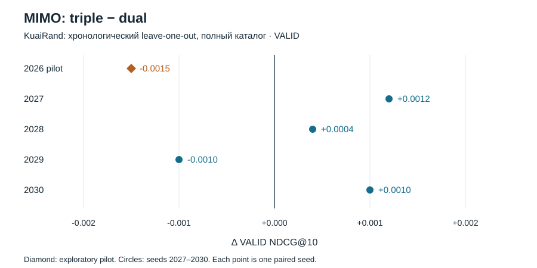
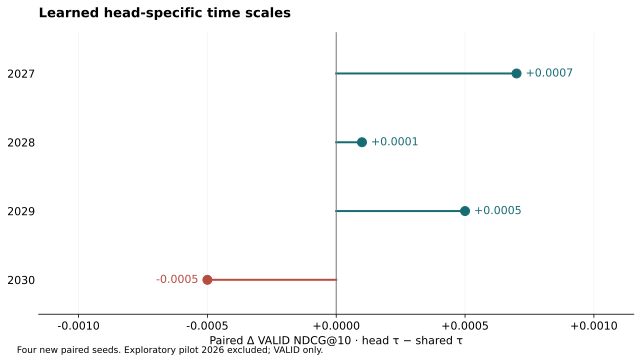

# Mamba3: результаты временных механизмов

Завершено сравнение двух и трёх внутренних временных механизмов Mamba3:
**пять пар SISO и пять троек MIMO, всего 25 запусков**. Base не использует
дополнительную временную калибровку; dual отдельно калибрует затухание, но
объединяет запись и фазу; triple разделяет все три пути. Коэффициенты зависят
от одного интервала между историческими событиями.

**KuaiRand: хронологический leave-one-out, полный каталог.** На четырёх новых
seeds 2027–2030 средний VALID NDCG@10 SISO dual/triple равен
**0.062775 / 0.063150** (+0.597%, три улучшения и одно снижение).
Для MIMO base/dual/triple: **0.059125 / 0.062925 / 0.063325**.
Оба временных варианта выше base во всех четырёх тройках; triple выше dual
в трёх из четырёх, средний прирост +0.636%. С exploratory pilot 2026
средние MIMO dual/triple почти совпадают: **0.063000 / 0.063020**.

Это небольшой, неодинаковый по seeds эффект третьего пути, а не доказательство
значимости, эквивалентности dual/triple или превосходства MIMO над SISO.
При сравнении с base вместе меняются число параметров и использование
интервалов, поэтому весь прирост нельзя приписать только временной информации.
Эти серии ограничены VALID одного датасета; TEST для них не запускался.
Первый пункт плана завершён в этом scope. Для временных масштабов голов завершены [пилот](#head-timescales-pilot) и [подтверждение](#head-timescales-confirmation).

[SISO](#siso-dual-triple-confirmation) · [MIMO](#mimo-time-confirmation) ·
[Единый индекс 25 runs и SHA256](assets/internal_time_ablation/sources.json) ·
[Сводная TeX-таблица VALID](assets/internal_time_ablation/siso_mimo_valid_table.tex).
Исторические shared/separate, experts и TEST ниже остаются отдельными сериями.

<a id="mimo-time-confirmation"></a>

## MIMO: подтверждение base / dual / triple

Основной набор — четыре заранее выбранные тройки seeds **2027–2030**, 12 новых
fits. Пилот **2026** повлиял на решение продолжить исследование, поэтому
объединение всех пяти троек показано отдельно. Все модели обучались с нуля
по неизменным настройкам соответствующего пилотного режима; менялись только
seed и путь сохранения. Внутри тройки совпали начальный backbone, RNG,
первый фактический batch, precision и настройки оптимизатора.

KuaiRand: хронологический leave-one-out, полный каталог; **VALID NDCG@10**.
Каждая ячейка метрики ведёт к исходному JSON.

<!-- mimo:pairs:start -->
| Seed | Base | Dual | Triple | Triple − dual | Dual − base | Triple − base |
|---|---:|---:|---:|---:|---:|---:|
| 2026 (пилот) | [0.0590](../experiments/mamba3_mimo_time/runs/attempt_003/mamba3_mimo_base_seed2026_001.json) | [0.0633](../experiments/mamba3_mimo_time/runs/attempt_003/mamba3_mimo_dual_seed2026_001.json) | [0.0618](../experiments/mamba3_mimo_time/runs/attempt_003/mamba3_mimo_triple_seed2026_001.json) | -0.0015 | +0.0043 | +0.0028 |
| 2027 | [0.0594](../experiments/mamba3_mimo_time/confirmation/runs/mamba3_mimo_confirm_base_seed2027_001.json) | [0.0625](../experiments/mamba3_mimo_time/confirmation/runs/mamba3_mimo_confirm_dual_seed2027_001.json) | [0.0637](../experiments/mamba3_mimo_time/confirmation/runs/mamba3_mimo_confirm_triple_seed2027_001.json) | +0.0012 | +0.0031 | +0.0043 |
| 2028 | [0.0592](../experiments/mamba3_mimo_time/confirmation/runs/mamba3_mimo_confirm_base_seed2028_001.json) | [0.0627](../experiments/mamba3_mimo_time/confirmation/runs/mamba3_mimo_confirm_dual_seed2028_001.json) | [0.0631](../experiments/mamba3_mimo_time/confirmation/runs/mamba3_mimo_confirm_triple_seed2028_001.json) | +0.0004 | +0.0035 | +0.0039 |
| 2029 | [0.0588](../experiments/mamba3_mimo_time/confirmation/runs/mamba3_mimo_confirm_base_seed2029_001.json) | [0.0641](../experiments/mamba3_mimo_time/confirmation/runs/mamba3_mimo_confirm_dual_seed2029_001.json) | [0.0631](../experiments/mamba3_mimo_time/confirmation/runs/mamba3_mimo_confirm_triple_seed2029_001.json) | -0.0010 | +0.0053 | +0.0043 |
| 2030 | [0.0591](../experiments/mamba3_mimo_time/confirmation/runs/mamba3_mimo_confirm_base_seed2030_001.json) | [0.0624](../experiments/mamba3_mimo_time/confirmation/runs/mamba3_mimo_confirm_dual_seed2030_001.json) | [0.0634](../experiments/mamba3_mimo_time/confirmation/runs/mamba3_mimo_confirm_triple_seed2030_001.json) | +0.0010 | +0.0033 | +0.0043 |
<!-- mimo:pairs:end -->

### Средние и парные разности

Во всех таблицах std — **sample standard deviation, ddof=1**, не доверительный
интервал. Разброс моделей и парных разностей рассчитан отдельно. Относительный
прирост — `100 × (mean(left) / mean(right) − 1)`. Индивидуальные метрики
сохранены с четырьмя знаками; точность исходных измерений от агрегации не растёт.

<!-- mimo:aggregates:start -->
| Seeds; n | Base: mean ± std | Dual: mean ± std | Triple: mean ± std |
|---|---:|---:|---:|
| 2027–2030; 4 | 0.059125 ± 0.000250 | 0.062925 ± 0.000793 | 0.063325 ± 0.000287 |
| 2026–2030; 5, с пилотом | 0.059100 ± 0.000224 | 0.063000 ± 0.000707 | 0.063020 ± 0.000726 |
<!-- mimo:aggregates:end -->

<!-- mimo:contrasts:start -->
| Seeds; n | Контраст | Парная Δ: mean ± std | + / − / 0 | Прирост по средним |
|---|---|---:|---:|---:|
| 2027–2030; 4 | triple-dual | +0.000400 ± 0.000993 | 3 / 1 / 0 | +0.636% |
| 2027–2030; 4 | dual-base | +0.003800 ± 0.001013 | 4 / 0 / 0 | +6.427% |
| 2027–2030; 4 | triple-base | +0.004200 ± 0.000200 | 4 / 0 / 0 | +7.104% |
| 2026–2030; 5, с пилотом | triple-dual | +0.000020 ± 0.001209 | 3 / 2 / 0 | +0.032% |
| 2026–2030; 5, с пилотом | dual-base | +0.003900 ± 0.000906 | 5 / 0 / 0 | +6.599% |
| 2026–2030; 5, с пилотом | triple-base | +0.003920 ± 0.000650 | 5 / 0 / 0 | +6.633% |
<!-- mimo:contrasts:end -->

**Dual и triple выше base на всех четырёх дополнительных seeds**, по средним
на +6.427% и +7.104%. Дополнительное разделение записи и фазы даёт небольшой
и неодинаковый эффект: triple−dual = +0.000400, три положительные пары и одна
отрицательная. С пилотом разница средних всего +0.000020 (+0.032%); отрицательны
**2026 (−0.0015) и 2029 (−0.0010)**. Близость средних не доказывает эквивалентность.
Новые критерии значимости не применялись, окончательный backbone не выбран.



### Срез первых 27 эпох

Окно включает только наблюдавшиеся эпохи **0–26**. У base/triple пилота всего
23 эпохи, у base2029 — 26. Это успешные fits с ранней остановкой, но без
полного окна first27; недостающие эпохи не дополнялись.

<!-- mimo:first27:start -->
| Seed | Base, first27 | Dual, first27 | Triple, first27 |
|---|---:|---:|---:|
| 2026 (пилот) | нет (23 эпох) | 0.0620 | нет (23 эпох) |
| 2027 | 0.0581 | 0.0625 | 0.0624 |
| 2028 | 0.0587 | 0.0610 | 0.0617 |
| 2029 | нет (26 эпох) | 0.0615 | 0.0625 |
| 2030 | 0.0591 | 0.0622 | 0.0633 |
<!-- mimo:first27:end -->

Для сравнения **всех трёх режимов** полное окно есть на seeds **2027, 2028,
2030 (n=3)**. Для отдельной пары **dual/triple** — на **всех четырёх новых
seeds 2027–2030 (n=4)**, включая 2029.

<!-- mimo:first27_aggregates:start -->
| Полные first27 окна; n | Base: mean ± std | Dual: mean ± std | Triple: mean ± std | Δ triple−dual: mean ± std |
|---|---:|---:|---:|---:|
| 2027, 2028, 2030; 3 | 0.058633 ± 0.000503 | 0.061900 ± 0.000794 | 0.062467 ± 0.000802 | +0.000567 ± 0.000611 |
| 2027, 2028, 2029, 2030; 4 | — | 0.061800 ± 0.000678 | 0.062475 ± 0.000655 | +0.000675 ± 0.000544 |
<!-- mimo:first27_aggregates:end -->

Для dual/triple на четырёх новых seeds first27 даёт +0.000675 (+1.092%),
три положительные пары и одну отрицательную (2027). Это другой срез тех же
histories, а не независимая репликация или равный GPU-бюджет. Best full-run
не подставлялся вместо first27.

<details>
<summary>Настройки, эпохи, диагностика по heads и происхождение</summary>

Upstream MIMO, rank 4, chunk 8; два слоя и две temporal heads. Rank не является
числом голов. История до 50 событий нейтрально дополняется до 56 только на
границе kernel. Число параметров base/dual/triple: **714888 / 715020 / 715086**.
Adam 0.001, batch 2048, максимум 300 эпох, stopping_step=10; выбирается последняя
эпоха с максимальным округлённым VALID NDCG@10. У dual2028 максимум 0.0627
достигнут в эпохах 36, 38, 46, выбран 46. Все 12 fits остановились после
11 последующих эпох. Одинаковое правило не означает одинаковое время обучения.

<!-- mimo:epochs:start -->
| Seed | HR@10 base / dual / triple | Best epoch (с нуля), B / D / T | Actual epochs, B / D / T |
|---|---:|---:|---:|
| 2026 (пилот) | 0.1074 / 0.1162 / 0.1136 | 11 / 27 / 11 | 23 / 39 / 23 |
| 2027 | 0.1086 / 0.1147 / 0.1172 | 32 / 17 / 35 | 44 / 29 / 47 |
| 2028 | 0.1099 / 0.1169 / 0.1169 | 40 / 46 / 38 | 52 / 58 / 50 |
| 2029 | 0.1069 / 0.1183 / 0.1168 | 14 / 87 / 28 | 26 / 99 / 40 |
| 2030 | 0.1077 / 0.1150 / 0.1176 | 23 / 28 / 31 | 35 / 40 / 43 |
<!-- mimo:epochs:end -->

В best diagnostics dual использует одинаковые write/phase scales, у triple
они различаются на всех пяти seeds. Ниже каждая пара значений соответствует
**H0 / H1**, а не двум слоям; функции общие для слоёв. Bounds [0.5, 2] и
TRAIN reference 838393 ms не менялись.

<!-- mimo:diagnostics:start -->
| Seed | mean abs log(write/phase), H0 / H1 | phase > 1.99, H0 / H1 |
|---|---:|---:|
| 2026 (пилот) | 0.322 / 1.179 | 0.37% / 100.00% |
| 2027 | 0.888 / 1.227 | 70.18% / 72.04% |
| 2028 | 0.583 / 1.120 | 9.69% / 0.00% |
| 2029 | 0.514 / 1.228 | 2.85% / 100.00% |
| 2030 | 1.239 / 0.533 | 100.00% / 0.00% |
<!-- mimo:diagnostics:end -->

Доли возле верхней границы различаются между heads и seeds; это не общая доля
модели. Например, у triple2029 второй phase head целиком около верхней границы,
а у triple2030 — первый. Эти наблюдения не устанавливают причину изменения
NDCG, специализацию по интересам или короткие/длинные масштабы памяти.
Использованы сохранённые diagnostics выбранной эпохи, без нового forward.

Источник новых runs — [фиксированный study plan](../experiments/mamba3_mimo_time/confirmation/study_plan.json),
job **4358583**, execution `5670e898ed04924a929756e52f39d1d00eb79c5a`.
[Исходные summary JSON](../experiments/mamba3_mimo_time/confirmation/runs/confirmation_summary.json)
и [Markdown](../experiments/mamba3_mimo_time/confirmation/runs/confirmation_summary.md)
сохранены без изменений. [Manifest сохранения](../experiments/mamba3_mimo_time/confirmation/evidence/job4358583/preservation_manifest.json)
содержит пути, размеры и SHA256 79 файлов. Веса остались на кластере; хеши
checkpoint сверены потоково с results и metadata, без десериализации.

Admission **45 случаев / 2342 обязательных checks** и smoke принадлежат
**pilot job4358147**, а не job4358583. Они унаследованы по исходным SHA;
повторных GPU gates при подтверждении и публикации не было. Действует
[mimo_numeric_acceptance_v1](../experiments/mamba3_mimo_time/mimo_numeric_acceptance_v1.json).
Старые exact-zero FAIL сохранены. Ограниченный численный допуск в проверенных
случаях не доказывает глобальную математическую эквивалентность.

[Единый source index](assets/internal_time_ablation/sources.json),
[пересчитанные агрегаты и время/память каждого run](assets/internal_time_ablation/summary.json),
[проверки публикации и их границы](assets/internal_time_ablation/PUBLICATION_AUDIT.md).
Исторические manifests проверяются по execution Git blobs; текущие отчёты
и CSV закономерно отличаются от execution snapshot. Модель, kernels, trainer,
policy и данные не изменялись.

```bash
python3 -B reports/assets/internal_time_ablation/report.py --audit
python3 -B -m unittest discover -s reports/assets/internal_time_ablation -p 'test_*.py'
```

Helper использует только стандартную библиотеку и читает сохранённые JSON.
Обычный запуск ничего не записывает. `--write-derived` обновляет только
производные материалы и отмеченные таблицы; `--append-registry` добавляет
отсутствующие научные строки, сохраняя старый CSV побайтно.

</details>

<a id="mimo-time-pilot"></a>

## MIMO base / dual / triple: пилот seed2026

**KuaiRand: хронологический leave-one-out, полный каталог.** Проверили отсутствие
временной калибровки (base), общий коэффициент записи/фазы при отдельном затухании
(dual) и три независимых коэффициента (triple). MIMO rank4/chunk8, две layers,
две temporal heads, история50 с нейтральным дополнением до56 на границе kernel.
Все три модели обучались с нуля: одинаковые данные, initial backbone, RNG,
первый фактический batch, optimizer и precision. Выбор по VALID NDCG@10:
последний равный максимум, максимум300 эпох, stopping_step10. TEST не использовался.

| Режим | Параметры | VALID NDCG@10 | HR@10 | Лучшее в эпохах0–26 | Best epoch (с нуля) | Actual epochs |
|---|---:|---:|---:|---|---:|---:|
| [base](../experiments/mamba3_mimo_time/runs/attempt_003/mamba3_mimo_base_seed2026_001.json) | 714888 | 0.0590 | 0.1074 | 0.0590, 23 наблюдения, неполное окно | 11 | 23 |
| [dual](../experiments/mamba3_mimo_time/runs/attempt_003/mamba3_mimo_dual_seed2026_001.json) | 715020 | 0.0633 | 0.1162 | 0.0620, 27 наблюдений, полное окно | 27 | 39 |
| [triple](../experiments/mamba3_mimo_time/runs/attempt_003/mamba3_mimo_triple_seed2026_001.json) | 715086 | 0.0618 | 0.1136 | 0.0618, 23 наблюдения, неполное окно | 11 | 23 |

Парные разницы VALID NDCG@10: **dual − base = +0.0043 (+7.288%)**;
**triple − dual = −0.0015 (−2.370%)**; **triple − base = +0.0028 (+4.746%)**.
Первые27 являются срезом исходной history; недостающие эпохи не заполнялись.

На seed2026 двухпутевая MIMO получила лучший VALID. Triple ниже dual, но выше base.
На этапе пилота повторяемость ещё не была установлена. Один seed не подтверждает
статистическую значимость, преимущество MIMO над SISO или пользу отдельного пути.
Итог всей серии приведён в [завершённом подтверждении](#mimo-time-confirmation).

В best diagnostics у обоих временных вариантов второй decay head насыщен возле
верхней границы2; у triple также насыщен второй phase head. Средние write scales
triple ≈0.553/0.663, phase ≈0.733/2.000. Это наблюдаемая диагностика, не установленная
причина снижения метрики. Bounds[0.5,2] и reference838393ms не менялись.

[Исходная сводка со всеми cutoff, временем и памятью](../experiments/mamba3_mimo_time/runs/attempt_003/pilot_summary.md),
[evidence и SHA256 manifest](../experiments/mamba3_mimo_time/evidence/job4358147/README.md).
Job4358147, execution `c1dd31eec7907c67348769b6a1811b89aa4011c0`:
admission45/45, обязательные checks2342/2342, smokePASS, scientific fits3/3.
Допуск действует по `mimo_numeric_acceptance_v1` с документированными численными
ограничениями; исторические exact-zero failures не отменены.

Подтверждение base/dual/triple на seeds2027–2030 завершено: 12 fresh fits
с неизменными настройками. [Выше](#mimo-time-confirmation) четыре новые тройки
показаны отдельно от всех пяти с exploratory pilot2026.

<a id="siso-dual-triple-confirmation"></a>

## Два и три внутренних временных механизма: SISO

### Что проверяли и в каких условиях

Проверили, полезно ли раздельно калибровать три внутренних временных пути Mamba3. В **dual** затухание состояния получает отдельный коэффициент, а запись и фаза используют общий. В **triple** затухание, запись и фаза имеют независимые коэффициенты. Входом остаётся **один исторический gap**, из которого строятся три обучаемые функции; новых внешних блоков, признаков и дополнительных слоёв нет. Число параметров меняется с **610572 до 610638**, то есть добавляется **66**. Использован backend `upstream` с исходными kernels; диагностические `stable_adt`/`stable_scan` в научной серии не применялись.

**KuaiRand: хронологический leave-one-out, полный каталог.** Все числа этого раздела относятся к **VALID**, TEST не использовался. Внутри каждой пары одинаковы данные, начальный backbone, общие параметры калибраторов, состояние RNG перед обучением и первый фактический batch. Обе модели обучались с нуля, а не продолжали checkpoint друг друга. Отдельная проверка четырёх новых пар подтверждает совпадение сохранённых Python/NumPy/CPU/CUDA/DataLoader RNG, precision и настроек оптимизатора. Число параметров между dual и triple намеренно различается; это не нарушение парности.

Правило выбора одинаково: лучший VALID NDCG@10, максимум 300 эпох, проверка после каждой эпохи, `stopping_step=10`; при равном лучшем score сохраняется последняя такая эпоха. Adam, learning rate 0.001, batch 2048, история до 50 событий, две Mamba layers. TRAIN reference для gap равен 838393 ms, диапазон scales ограничен [0.5, 2]. Полные настройки и все cutoff сохранены в исходных JSON. Одинаковое правило остановки не означает одинаковые фактические горизонты или GPU-время.

Seed **2026** является exploratory pilot: его результат использован при решении продолжить исследование. Seeds **2027–2030** составляют четыре дополнительные заранее выбранные пары. Поэтому основное подтверждающее сравнение показано отдельно от объединения с пилотом. Завершены восемь подтверждающих fits и два пилотных; унаследованный dual2027 учтён один раз, без переобучения.

### Парные результаты и основной вывод

<!-- siso:pairs:start -->
| Seed | Dual NDCG@10 | Triple NDCG@10 | Triple − dual |
|---|---:|---:|---:|
| 2026 (пилот) | 0.0615 | 0.0623 | +0.0008 |
| 2027 | 0.0632 | 0.0628 | -0.0004 |
| 2028 | 0.0627 | 0.0630 | +0.0003 |
| 2029 | 0.0625 | 0.0635 | +0.0010 |
| 2030 | 0.0627 | 0.0633 | +0.0006 |
<!-- siso:pairs:end -->

В агрегатах ниже **std является sample standard deviation с ddof=1**, не доверительным интервалом. Разброс dual, triple и парных разностей рассчитан отдельно. Относительный прирост равен `100 × (mean(triple) / mean(dual) − 1)`. Исходные метрики сохранены с четырьмя десятичными знаками; дополнительные знаки среднего отражают агрегацию, а не повышение точности отдельных измерений.
Первая строка содержит **n=4 пары, seeds 2027–2030**, вторая — **n=5 пар, seeds 2026–2030**.

<!-- siso:aggregates:start -->
| Пары | Dual: mean ± std | Triple: mean ± std | Парная Δ: mean ± std | + / − / 0 | Прирост по средним |
|---|---:|---:|---:|---:|---:|
| 2027–2030, подтверждение | 0.062775 ± 0.000299 | 0.063150 ± 0.000311 | 0.000375 ± 0.000591 | 3 / 1 / 0 | +0.597% |
| 2026–2030, включая пилот | 0.062520 ± 0.000626 | 0.062980 ± 0.000466 | 0.000460 ± 0.000546 | 4 / 1 / 0 | +0.736% |
<!-- siso:aggregates:end -->

**Независимая калибровка записи и фазы дала небольшой средний прирост на дополнительных seeds. Улучшение наблюдалось в трёх из четырёх пар; один seed показал снижение.** Для подтверждающей серии это +0.000375 NDCG@10, около +0.597%; с exploratory pilot отдельно получается +0.000460, около +0.736%. Отрицательная пара 2027 не исключена. Эти результаты не устанавливают статистическую значимость или устойчивое превосходство и не являются сравнением с SOTA.


### Дополнительные наблюдения и ограничения

За первые **27 эпох, индексы 0–26**, средние dual/triple на четырёх новых seeds равны **0.061950 / 0.062400**; парная разница **+0.000450**, три улучшения и одно снижение. На всех пяти: **0.061860 / 0.062380**, разница **+0.000520**. У dual2027 в этом окне максимум **0.0614**, не итоговые 0.0632. Здесь отрицательна пара 2030. Это другой срез тех же histories, а не независимое подтверждение; одинаковое число эпох также не уравнивает вычислительную стоимость.

Сохранённые `best_diagnostics` показывают, что write/phase в triple действительно различаются. На четырёх новых seeds средняя абсолютная разница log-scales составляет примерно **0.693–1.026**, корреляция **−0.380…0.001**. Есть заметное приближение к границам: максимум по двум temporal heads доли `write < 0.51` составляет **65.5–69.9%**, а `phase > 1.99` достигает **100%** на seed2029. Это **максимумы по heads**, не общая доля всей модели. Коэффициенты общие для двух слоёв: H0/H1 обозначают головы, не слои.

Такая диагностика описывает найденные функции, но не доказывает причинное влияние отдельных heads, короткие/долгие интересы или объяснение прироста. Она относится к выбранной лучшей эпохе, не к последней; никаких новых forward для публикации не выполнялось. Насыщение ограничений заслуживает дальнейшего разбора, но здесь не послужило поводом менять диапазон или выбирать другие настройки.

Область вывода ограничена одним датасетом и VALID split. Пилот не является независимым подтверждением. Историческая **separate=0.0633** относится к другой серии и не подставляется вместо нового dual; успешный одношаговый gate также не объясняет автоматически историческую разницу 0.0633/0.0615. **Triple остаётся перспективным кандидатом, dual обязательным контролем**; окончательный backbone автоматически не выбран.

### Статус плана

1. Три временных механизма: SISO и [MIMO confirmation](#mimo-time-confirmation) завершены, по пять seeds, в рамках текущего KuaiRand/VALID-протокола.
2. Обучаемые временные масштабы heads: [пилот и подтверждение завершены](#head-timescales-confirmation). Head-specific reference scales не выбраны как обязательное усложнение; контроль — MIMO dual fixed.
3. Зависящее от gap трапециевидное смешивание: [one-sided](#gap-trap-one-sided-pilot) и [centered](#gap-trap-centered-pilot) pilots завершены. Пункт закрыт на текущем KuaiRand/VALID exploratory этапе; устойчивость небольшого centered-выигрыша не установлена.
4. Временные функции отдельно по слоям: не реализованы и не проверены.
5. Явная временная память состояния: отложенная гипотеза.

<details>
<summary>Эпохи, диагностика, происхождение и воспроизводимость</summary>

<!-- siso:epochs:start -->
| Seed | HR@10 dual / triple | Лучшая эпоха dual / triple (с нуля) | Всего эпох dual / triple |
|---|---:|---:|---:|
| 2026 | 0.1142 / 0.1148 | 15 / 15 | 27 / 27 |
| 2027 | 0.1167 / 0.1172 | 53 / 37 | 65 / 49 |
| 2028 | 0.1153 / 0.1163 | 29 / 29 | 41 / 41 |
| 2029 | 0.1165 / 0.1186 | 46 / 61 | 58 / 73 |
| 2030 | 0.1159 / 0.1156 | 23 / 45 | 35 / 57 |
<!-- siso:epochs:end -->

<!-- siso:first27:start -->
| Seed | Dual, первые 27 | Triple, первые 27 | Δ |
|---|---:|---:|---:|
| 2026 | 0.0615 | 0.0623 | +0.0008 |
| 2027 | 0.0614 | 0.0623 | +0.0009 |
| 2028 | 0.0618 | 0.0623 | +0.0005 |
| 2029 | 0.0619 | 0.0625 | +0.0006 |
| 2030 | 0.0627 | 0.0625 | -0.0002 |
<!-- siso:first27:end -->

Диагностика triple лучшей эпохи; доли около границ являются **максимумом по двум temporal heads**:

<!-- siso:diagnostics:start -->
| Seed | Средняя абсолютная Δ log(write/phase) | Корреляция log-scales | max head: write < 0.51 | max head: phase > 1.99 |
|---|---:|---:|---:|---:|
| 2027 | 1.026 | -0.380 | 69.8% | 86.3% |
| 2028 | 0.891 | -0.153 | 69.9% | 0.0% |
| 2029 | 0.973 | -0.044 | 68.2% | 100.0% |
| 2030 | 0.693 | 0.001 | 65.5% | 69.0% |
<!-- siso:diagnostics:end -->

Источники выбраны только по [замороженному source_index](../experiments/mamba3_three_time/confirmation/resume_plan_003.json). [Индекс публикации и SHA256](assets/three_time_confirmation/sources.json) различает pilot / parent / new: job4353980, job4355052 и job4355314 соответственно. Родительский dual2027 не приписан последнему job. [Исходная финальная сводка](../experiments/mamba3_three_time/confirmation/runs/attempt_003/confirmation_summary.json) и [Markdown](../experiments/mamba3_three_time/confirmation/runs/attempt_003/confirmation_summary.md) сохранены побайтно. Raw SVG для attempt003 не создавался; встроенный график является отдельным производным материалом.

Во всей научной серии действует [numeric policy v1](../experiments/mamba3_three_time/validation_pilot/numeric_acceptance_v1.json). Исторические exact-zero FAIL не отменены и остаются в evidence. Унаследованные B/C и initialization gates сохранены с исходными SHA256, не выдаются за новые проверки. [Аудит сопоставимости пилота](SISO_DUAL_TRIPLE_PILOT_AUDIT.md), [разрешённая lineage](../experiments/mamba3_three_time/confirmation/resume_lineage_003.json), [manifest сохранения](../experiments/mamba3_three_time/confirmation/evidence/job4355314/preservation_manifest.json).

Все десять checkpoint проверены потоковым SHA256 на кластере, без десериализации или копирования моделей в Git. Для воспроизведения нужны **execution commits** из индекса, а не publication commit: он добавляет результаты и описание. Исторические manifest проверяются через `git show <execution_commit>:<path>`. Текущие общие отчёты и CSV после публикации закономерно отличаются от execution snapshot; математические Python/YAML, policy, tests и guards не менялись. [Проверки и пределы публикационного аудита](assets/three_time_confirmation/PUBLICATION_AUDIT.md).

[Независимая агрегация](assets/three_time_confirmation/summary.json) и [stdlib helper](assets/three_time_confirmation/report.py) воспроизводят таблицы, SVG и [отдельную booktabs-таблицу для Overleaf](assets/three_time_confirmation/siso_dual_triple_table.tex). Обычный запуск helper только проверяет сохранённые данные; `--write-derived` обновляет лишь производные материалы и размеченные таблицы отчёта, не raw results. Старые experimental report/submit модули не запускались.

```bash
python3 -B reports/assets/three_time_confirmation/report.py --audit
python3 -B -m unittest discover -s reports/assets/three_time_confirmation -p 'test_*.py'
```

</details>

<a id="context-time-pilot"></a>

## Контекстная калибровка и временные эксперты: первый эксперимент

Проверили, помогает ли учитывать контекст исторического видео при дополнительной калибровке времени и нужна ли для этого экспертная факторизация. Пять вариантов обучены с нуля на seed2026 с одинаковыми правилами обучения и выбора checkpoint по **VALID NDCG@10**, на том же хронологическом разбиении KuaiRand с полным каталогом. Основной comparator здесь **separate_replay** этого эксперимента, не среднее пятисидовой серии и не опубликованный TiM4Rec TEST.

Это **не четыре MLP после итогового h**: четыре пары экспертов предлагают функции исторического интервала для внутренних decay/scan scales. Router видит embedding текущего исторического видео и gap, но не весь user state, target или t_score; он смешивает ограниченные log-scales до экспоненты. Uniform использует равные веса, dense11/dense12 являются обычными сетями по тем же входам без MoE; изменение DT затрагивает phase и input weighting, не только периодичность. [Формулы, входы и фиксированные настройки](../experiments/mamba3_context_time/README.md).

| Вариант (mode; ссылка на raw JSON) | VALID NDCG@10 | HR@10 | Δ NDCG@10 к separate_replay | Лучший NDCG@10 за первые 27 эпох |
|---|---:|---:|---:|---:|
| Контроль separate ([separate_replay](../experiments/mamba3_context_time/runs/mamba3_context_separate_replay_seed2026_001.json)) | 0.0633 | 0.1176 | 0.0000 | 0.0614 |
| Контекстная сеть, ширина 11 ([dense11](../experiments/mamba3_context_time/runs/mamba3_context_dense11_seed2026_001.json)) | 0.0614 | 0.1124 | -0.0019 | 0.0614 |
| Контекстная сеть, ширина 12 ([dense12](../experiments/mamba3_context_time/runs/mamba3_context_dense12_seed2026_001.json)) | 0.0635 | 0.1177 | +0.0002 | 0.0619 |
| Эксперты с равными весами ([uniform](../experiments/mamba3_context_time/runs/mamba3_context_uniform_seed2026_001.json)) | 0.0628 | 0.1163 | -0.0005 | 0.0613 |
| Эксперты с обучаемым router ([routed](../experiments/mamba3_context_time/runs/mamba3_context_routed_seed2026_001.json)) | 0.0628 | 0.1164 | -0.0005 | 0.0620 |

**Вывод:** в первоначальном сравнении на seed2026 обучаемая маршрутизация временных экспертов не улучшила итоговый VALID NDCG@10. Routed и uniform дали 0.0628 против 0.0633 у separate. Проверенный экспертный вариант пока не включается в основную модель; separate остаётся рабочей основой.

Dense12 получил **0.0635**, то есть **+0.0002, около +0.32%** к replay, но это один seed, без подтверждённого устойчивого превосходства. За первые 27 эпох (индексы 0–26) routed получил **0.0620 против 0.0614** у separate: это дополнительное наблюдение, не замена основного критерия итогового VALID. Равенство routed/uniform относится к NDCG@10 с доступным округлением до четырёх знаков, а не ко всем неокруглённым scores или метрикам.


[SVG](../experiments/mamba3_context_time/runs/pilot_summary.svg) · [Исходная JSON-сводка](../experiments/mamba3_context_time/runs/pilot_summary.json) · [Автоматический отчёт с epochs и временем](../experiments/mamba3_context_time/runs/pilot_summary.md) · [GPU evidence](../experiments/mamba3_context_time/runs/gpu_checks_001.json) · [Происхождение и SHA256](assets/context_time/sources.json). Raw JSON содержат все cutoff и histories; оригиналы сводки и графика сохранены побайтно.

### Что показывает сохранённая диагностика

На лучшей эпохе routed средние вероятности экспертов составили **[0.203, 0.322, 0.149, 0.327]**, средняя энтропия **1.178 нат**; доли argmax **[16.1%, 36.1%, 7.4%, 40.4%]**. У uniform веса фиксированы **[0.25, 0.25, 0.25, 0.25]** (энтропия таких весов ln4 ≈ 1.386), обучаемого router нет. Дисперсии вероятностей routed в сохранённой выборке 2048 позиций: **[0.0120, 0.0319, 0.0104, 0.0290]**. Средняя дисперсия при одинаковом gap **0.0126**, однако повторяющаяся gap-группа в этой выборке только одна: обобщать этот показатель на все интервалы нельзя.

Эксперты предлагают различающиеся log-scales: среднее по активным позициям стандартное отклонение между экспертами для routed равно **[0.423, 0.223]** в decay и **[0.156, 0.385]** в scan; для uniform соответственно **[0.419, 0.220]** и **[0.119, 0.063]**. Доли scales около границ (`s < 0.51` или `s > 1.99`) у routed: decay **[0%, 22.5%]**, scan **[54.4%, 0%]**; у uniform: **[4.6%, 29.6%]** и **[55.5%, 0%]**. В каждой паре **H0/H1 являются головами, не слоями**.

Это `best_diagnostics` на эпохах 35 и 54 соответственно, с нумерацией с нуля, а не дополнительная оценка checkpoint. Диагностика показывает изменчивый выбор, но не объясняет отсутствие прироста и не устанавливает семантику коротких/долгих интересов; равные итоговые метрики не доказывают, что router не обучался, а средние probabilities сами по себе не доказывают collapse.

**Ограничения:** один seed, один датасет и VALID split, разные фактические горизонты обучения. Separate replay является повтором seed2026 для проверки runner, **не шестым независимым seed** прежней серии; совпадение лучшей метрики и эпох не заявляется как побитовая идентичность всей истории. Этот результат не опровергает все возможные MoE. TEST не выполнялся, выводы не смешиваются с TEST-таблицами или mean±std исследования ниже.

<a id="confirmation"></a>

## Подтверждение shared/separate

Сравнили одну общую и две раздельные функции исторического интервала для decay и scan/input-weight dynamics. На KuaiRand с оценкой по полному каталогу separate превысил shared по лучшему **VALID NDCG@10 во всех пяти парных seeds**; constant-gap control на одном seed уступил реальным интервалам. [Входы и условия оценки](EVALUATION_SETUP.md).

| Вариант | Seeds | VALID NDCG@10 mean ± sample std |
|---|---|---:|
| shared | 2026–2030 | 0.061700 ± 0.000875 |
| separate | 2026–2030 | 0.062880 ± 0.000512 |

**+1.91% по средним**, парная разница в среднем **+0.001180**, положительных пар **5/5**. Seed 2026 переиспользован из исходного эксперимента, не является новой репликацией. На четырёх новых seeds 2027–2030: shared **0.062000**, separate **0.062775**, разница **+0.000775**, **+1.25%**, **4/4** положительных пары.

| Seed | Shared | Separate | Separate−shared |
|---|---:|---:|---:|
| 2026 | 0.0605 | 0.0633 | +0.0028 |
| 2027 | 0.0620 | 0.0628 | +0.0008 |
| 2028 | 0.0629 | 0.0635 | +0.0006 |
| 2029 | 0.0617 | 0.0623 | +0.0006 |
| 2030 | 0.0614 | 0.0625 | +0.0011 |

**Первые 27 эпох (индексы 0–26), пять seeds:** shared **0.061000 ± 0.000339**, separate **0.062060 ± 0.000416**. Средняя парная разница **+0.001060**, **+1.74%**, **5/5** положительных пар. Везде sample std рассчитан с **ddof=1**, это не доверительный интервал; сравниваются лучшие VALID внутри указанного горизонта.

### Constant-gap, seed 2026

| Режим | Seed | Best VALID за первые 27 эпох | Best VALID за весь запуск |
|---|---:|---:|---:|
| separate, real-gap | 2026 | 0.0614 | 0.0633 |
| separate, constant-gap | 2026 | 0.0586 | 0.0586 |

Constant-gap сохраняет items, порядок и длины, но заменяет каждый активный временной интервал на TRAIN reference 838393 ms. В этом запуске информация о реальных интервалах оказалась полезнее такого контроля; это не доказательство периодичности интересов.


[PNG](assets/time_confirmation/paired_ndcg10.png) · [JSON агрегации](assets/time_confirmation/summary.json) · [Источники и SHA256](assets/time_confirmation/sources.json). На графике реальные точки; 2026 обозначает исходные запуски, остальные seeds новые.

### Ограничения

Один датасет и один VALID split; пять seeds для shared/separate, но constant-gap и decay_only/scan_only пока имеют по одному seed. Первые 27 эпох уравнивают число эпох, а не GPU-время; полные запуски остановились в разные моменты. Статистическая значимость автоматически не заявляется, многосидовое превосходство separate над decay_only/scan_only не проверено. Shared TEST был известен до этой серии; **новых TEST нет**. VALID не добавляется в [сравнение с опубликованными TEST](PAPER_RESULTS.md).

## Подробные результаты и воспроизводимость

Девять новых JSON содержат все HR/Recall/NDCG @5/10/20/50, непрерывные histories и диагностику лучшей эпохи. В [индексе](assets/time_confirmation/sources.json) указаны исходные пути, SHA256, mode, seed, execution commit и фактический job ID. Исторические shared/separate seed 2026 переиспользуются по ссылкам; их JSON не копировались как новые запуски. Все девять checkpoint существуют, SHA256 проверены потоковым чтением без десериализации.

`best_diagnostics` относятся к `best_epoch` (нумерация с нуля), а не к последней эпохе. **Head H0/H1** обозначают головы; коэффициенты общие для двух Mamba layers, это не «слой 1/2». Новые распределения и корреляции сохранены в raw JSON, исходная диагностика ниже относится только к seed 2026.

[Зафиксированный план](../experiments/mamba3_time_confirmation/study_plan.json) и [read-only aggregator](../experiments/mamba3_time_confirmation/aggregate.py) сохранены без изменений. Дополнительная сводка и строки реестра воспроизводятся [report.py](assets/time_confirmation/report.py); [render.py](assets/time_confirmation/render.py) строит SVG и PNG из тех же JSON (нужен Pillow и шрифт с кириллицей).

```bash
PYTHONDONTWRITEBYTECODE=1 python -m experiments.mamba3_time_confirmation.aggregate
PYTHONDONTWRITEBYTECODE=1 python reports/assets/time_confirmation/report.py
PYTHONDONTWRITEBYTECODE=1 python reports/assets/time_confirmation/render.py
```

Команды читают сохранённые результаты; только renderer записывает производные изображения. Summary JSON сохраняет stdout существующего aggregator; научных запусков эти команды не выполняют. Исторический тест сравнения целых каталогов со старым main не изменялся: для публикации проверены реальные core/study fingerprints и SHA256 исходных результатов.

<a id="initial-study"></a>

<details>
<summary>Исходное исследование seed 2026: все cutoff, бюджеты и диагностика</summary>

## Гипотеза

Нужна ли одинаковая функция physical gap для decay (`ADT`) и scan/input-weight/
rotary dynamics (`DT`)? `decay_only` и `scan_only` включают один путь,
`shared` использует одну функцию для обоих, `separate` — две независимые.
Остальные backbone, CE, scorer, reference 838393 ms и bounds [0.5,2] frozen.
Подробные формулы — [implementation README](../experiments/mamba3_time_mechanisms/README.md).

## VALID

Каждая ячейка содержит @5 / @10 / @20 / @50. Один relevant target: HR=Recall.
Числа извлечены из source JSON; original execution commits не переписаны.

| Mode | HR / Recall @5/10/20/50 | NDCG @5/10/20/50 | Best epoch (0-based) | Actual epochs | Parameters |
|---|---|---|---:|---:|---:|
| vanilla | .0648 / .1078 / .1738 / .3114 | .0446 / .0584 / .0749 / .1021 | 15 | 27 | 610440 |
| shared RT | .0682 / .1111 / .1800 / .3204 | .0468 / .0605 / .0778 / .1055 | 15 | 27 | 610506 |
| decay_only | .0688 / .1132 / .1797 / .3200 | .0470 / .0612 / .0779 / .1056 | 15 | 27 | 610506 |
| scan_only | .0684 / .1131 / .1807 / .3221 | .0468 / .0611 / .0780 / .1059 | 15 | 27 | 610506 |
| separate | .0692 / .1176 / .1896 / .3374 | .0478 / .0633 / .0813 / .1105 | 51 | 63 | 610572 |

| Mode | NDCG@10 delta vs vanilla | Relative | Delta vs shared | Relative |
|---|---:|---:|---:|---:|
| shared | +.0021 | +3.5959% | .0000 | 0.0000% |
| decay_only | +.0028 | +4.7945% | +.0007 | +1.1570% |
| scan_only | +.0027 | +4.6233% | +.0006 | +0.9917% |
| separate | +.0049 | +8.3904% | +.0028 | +4.6281% |

Это первоначальное сравнение seed 2026. Подтверждение shared/separate приведено выше;
TEST этих новых вариантов не выполнялся.

## Обучение и бюджет


Истории всех пяти runs сохранились. Separate в первых 27 эпохах (0–26):
**0.0614 на эпохе 23**, delta к shared +.0009 (+1.4876%). Итоговые .0633
получены позже, на эпохе 51 (52-я эпоха). Поэтому сравнение .0633 с максимумом
shared за 27 эпох не изолирует влияние дополнительного времени обучения.
Правила max300/patience10 одинаковы, фактический бюджет различается.
Vanilla имеет равные округлённые максимумы на 11 и 15; сохранён checkpoint 15,
что подтверждает existing final-test provenance. График отмечает выбранный checkpoint.

| Mode | Actual epochs | Время между timestamps run JSON, секунды |
|---|---:|---:|
| vanilla | 27 | 386.96 |
| shared | 27 | 414.00 |
| decay_only | 27 | 697.01 |
| scan_only | 27 | 668.43 |
| separate | 63 | 1150.84 |

Это время runner, не Slurm allocation и не только training kernel time.
Per-epoch training/VALID timings сохранены в [данных графиков](assets/time_mechanisms/extracted.json).

## Функции calibrator


В первоначальном этапе на CPU были загружены доверенные best checkpoints; извлечены параметры
calibrator. Сетка: 121 log-spaced положительных gaps между frozen TRAIN min/max,
плюс reference и отдельный active zero. Ни Mamba forward, ни ranking evaluation
не выполнялись. Все пять checkpoint доступны; пути, SHA256, source/log SHA,
маленькие веса и значения функций — в [provenance](assets/time_mechanisms/extracted.json).
[Извлечение](assets/time_mechanisms/extract.py), [рендер](assets/time_mechanisms/render.py).

Active zero-gap отмечен отдельной точкой; first event и padding всегда дают 1,
не смешиваются с такими точками. Кривые функций на сетке не являются
распределением коэффициентов на реальных VALID histories.

## Распределения на VALID

Именно `best_diagnostics` исходных JSON: 724401 active history-gap occurrences,
padding/first исключены. Mean/std/min/max точные; quantiles приблизительные,
reservoir 8192 с собственным RNG. Повторяющиеся gaps в prefixes учитываются повторно.

| Mode/path | Head | Mean | Std | p10 | p50 | p90 |
|---|---:|---:|---:|---:|---:|---:|
| decay_only/decay | H0 | 1.999910 | .000102 | 1.999745 | 1.999971 | 2.000000 |
| decay_only/decay | H1 | .836214 | .439993 | .502807 | .612231 | 1.642123 |
| scan_only/scan | H0 | .765376 | .405650 | .505826 | .543320 | 1.513760 |
| scan_only/scan | H1 | .787525 | .126271 | .593296 | .823963 | .933462 |
| separate/decay | H0 | 1.138654 | .450420 | .519576 | 1.300120 | 1.628739 |
| separate/decay | H1 | .908804 | .495633 | .504781 | .637370 | 1.794623 |
| separate/scan | H0 | .632056 | .303651 | .501674 | .502632 | 1.014333 |
| separate/scan | H1 | .800682 | .052129 | .766373 | .786225 | .878568 |

Decay-only Head H0 почти насыщен у upper bound 2; separate scan Head H0 часто
близок к lower bound. Это описательная диагностика, не повод менять bounds
после наблюдения результата. Для shared сохранились checkpoint functions,
но отдельное VALID scale distribution в исходном run отсутствует.

Separate: pooled log-correlation **−0.536664**, mean absolute log-difference
**0.635848**, доля decay>scan **0.566871**. Pooled означает объединение heads;
per-head correlation на VALID не сохранена и не восстанавливается по grid.
Эта корреляция не доказывает независимые физические механизмы или периодичность.

Источники исходного сравнения: [decay_only](../experiments/mamba3_time_mechanisms/runs/mamba3_decay_only_validation_001.json), [scan_only](../experiments/mamba3_time_mechanisms/runs/mamba3_scan_only_validation_001.json), [separate](../experiments/mamba3_time_mechanisms/runs/mamba3_separate_time_validation_001.json), [shared](../experiments/mamba3_timeaware/runs/mamba3_timeaware_validation_001.json), [vanilla](../experiments/mamba3_baseline/runs/mamba3_validation_001.json). [GPU evidence](../experiments/mamba3_time_mechanisms/runs/gpu_equivalence_001.json) и старые графики сохранены без изменений.

</details>

<!-- head-timescales:pilot:start -->
<a id="head-timescales-pilot"></a>
## Обучаемые временные масштабы: пилот

[Завершённое подтверждение на четырёх новых seeds](#head-timescales-confirmation).

Завершены три новых TRAIN→VALID запуска на seed2026, job4362620. Основа — MIMO dual, rank4/chunk8, два слоя и две temporal heads. Fixed сохраняет TRAIN reference R₀=838393 мс; shared_tau обучает один R на механизм decay/scan; head_tau — отдельный R для каждой головы каждого механизма. Параметры R общие для пользователей и слоёв.

`R=R₀·exp(log(4)·tanh(α))`, bounds `[R₀/4,4R₀]`, output scales `[0.5,2]`. Конфигурация, данные, начальный backbone, общие MLP и RNG совпадают. Gate 9/9 cases, 228/228 checks; smoke 3×3 шага. TEST не выполнялся.

| Variant | Parameters | VALID NDCG@10 | HR@10 | Best epoch, с нуля | Epochs | Best first27 |
|---|---:|---:|---:|---:|---:|---:|
| [fixed](../experiments/mamba3_head_timescales/runs/attempt_002/mamba3_headtime_fixed_seed2026_001.json) | 715020 | 0.0633 | 0.1162 | 27 | 39 | 0.0620 |
| [shared_tau](../experiments/mamba3_head_timescales/runs/attempt_002/mamba3_headtime_shared_tau_seed2026_001.json) | 715022 | 0.0627 | 0.1165 | 27 | 39 | 0.0617 |
| [head_tau](../experiments/mamba3_head_timescales/runs/attempt_002/mamba3_headtime_head_tau_seed2026_001.json) | 715024 | 0.0639 | 0.1191 | 48 | 60 | 0.0621 |

| Контраст | Δ VALID NDCG@10 | Относительно контроля |
|---|---:|---:|
| head_tau − shared_tau | +0.0012 | +1.914% |
| head_tau − fixed | +0.0006 | +0.948% |
| shared_tau − fixed | -0.0006 | -0.948% |

Общая шкала в этом пилоте не улучшила основную метрику; индивидуальные шкалы дали положительную разницу. Head достиг лучшего результата позже. First27 — реальные эпохи 0–26 из тех же histories, не независимая репликация и не равный GPU-бюджет.

| Variant | Mechanism | Head/shared | α | R/R₀ | R, мс |
|---|---|---|---:|---:|---:|
| fixed | decay | оба heads | — | 1.000000 | 838393 |
| fixed | scan | оба heads | — | 1.000000 | 838393 |
| shared_tau | decay | shared | -0.205215 | 0.755360 | 633288 |
| shared_tau | scan | shared | 0.101182 | 1.150034 | 964181 |
| head_tau | decay | h0 | -0.280562 | 0.684513 | 573891 |
| head_tau | decay | h1 | -0.962438 | 0.355834 | 298329 |
| head_tau | scan | h0 | -0.053040 | 0.929173 | 779012 |
| head_tau | scan | h1 | 0.332417 | 1.559822 | 1307744 |

Все обучаемые α изменились; near-reference-bound flags в histories false. Сохранённые scale(gap) не сводятся к одному R: decay второй головы почти насыщен на верхнем output bound. R — масштаб нормировки, не итоговый коэффициент затухания и не доказанный период интересов. Разные R не устанавливают специализацию голов.

Новый fixed точно воспроизвёл 39 эпох, метрики и checkpoint SHA исторического MIMO dual seed2026. В реестре это отдельный выполненный run; в прежнюю MIMO-статистику он не добавлен как независимый seed. Совпадение метрики не было условием technical PASS.

Один exploratory seed не устанавливает устойчивость или статистическую значимость. Сравнения нашего VALID с опубликованным TEST и утверждения о новом SOTA здесь нет.

[Raw summary](../experiments/mamba3_head_timescales/runs/attempt_002/pilot_summary.json), [preservation и SHA](../experiments/mamba3_head_timescales/evidence/job4362620/preservation_manifest.json). Execution `4724392c88a2298e57fa662cba33baa3ab9ecdbb`; исходный failed job4361071 сохранён отдельно.
<!-- head-timescales:pilot:end -->

<!-- head-timescales:confirmation:start -->
<a id="head-timescales-confirmation"></a>
## Обучаемые временные масштабы: подтверждение

Завершены12 новых fresh fits: fixed/shared_tau/head_tau на заранее выбранных seeds2027–2030. Все три контроля сохранены независимо от качества. Основной контраст — head_tau−shared_tau. Пилот2026 показан отдельно; исторический MIMO dual2026 повторно в статистику не включён. Только VALID, TEST=0.

| Seed | Fixed | Shared τ | Head τ | Δ head−shared | Δ head−fixed | Δ shared−fixed |
|---|---:|---:|---:|---:|---:|---:|
| 2027 | [0.0625](../experiments/mamba3_head_timescales/confirmation/runs/attempt_001/mamba3_headtime_confirm_fixed_seed2027_001.json) | [0.0628](../experiments/mamba3_head_timescales/confirmation/runs/attempt_001/mamba3_headtime_confirm_shared_tau_seed2027_001.json) | [0.0635](../experiments/mamba3_head_timescales/confirmation/runs/attempt_001/mamba3_headtime_confirm_head_tau_seed2027_001.json) | +0.0007 | +0.0010 | +0.0003 |
| 2028 | [0.0627](../experiments/mamba3_head_timescales/confirmation/runs/attempt_001/mamba3_headtime_confirm_fixed_seed2028_001.json) | [0.0629](../experiments/mamba3_head_timescales/confirmation/runs/attempt_001/mamba3_headtime_confirm_shared_tau_seed2028_001.json) | [0.0630](../experiments/mamba3_head_timescales/confirmation/runs/attempt_001/mamba3_headtime_confirm_head_tau_seed2028_001.json) | +0.0001 | +0.0003 | +0.0002 |
| 2029 | [0.0641](../experiments/mamba3_head_timescales/confirmation/runs/attempt_001/mamba3_headtime_confirm_fixed_seed2029_001.json) | [0.0628](../experiments/mamba3_head_timescales/confirmation/runs/attempt_001/mamba3_headtime_confirm_shared_tau_seed2029_001.json) | [0.0633](../experiments/mamba3_head_timescales/confirmation/runs/attempt_001/mamba3_headtime_confirm_head_tau_seed2029_001.json) | +0.0005 | -0.0008 | -0.0013 |
| 2030 | [0.0624](../experiments/mamba3_head_timescales/confirmation/runs/attempt_001/mamba3_headtime_confirm_fixed_seed2030_001.json) | [0.0625](../experiments/mamba3_head_timescales/confirmation/runs/attempt_001/mamba3_headtime_confirm_shared_tau_seed2030_001.json) | [0.0620](../experiments/mamba3_head_timescales/confirmation/runs/attempt_001/mamba3_headtime_confirm_head_tau_seed2030_001.json) | -0.0005 | -0.0004 | +0.0001 |

Mean ± sample std, ddof=1. Относительные разницы посчитаны по средним на одинаковом наборе seeds.

| Набор | n | Fixed | Shared τ | Head τ |
|---|---:|---:|---:|---:|
| Четыре новых seed | 4 | 0.062925 ± 0.000793 | 0.062750 ± 0.000173 | 0.062950 ± 0.000666 |
| Пять с exploratory pilot | 5 | 0.063000 ± 0.000707 | 0.062740 ± 0.000152 | 0.063140 ± 0.000716 |

| Набор | Контраст | Δ mean ± std | + / − / 0 | Relative % |
|---|---|---:|---:|---:|
| Новые4 | head_tau-shared_tau | +0.000200 ± 0.000529 | 3/1/0 | +0.319% |
| Новые4 | head_tau-fixed | +0.000025 ± 0.000793 | 2/2/0 | +0.040% |
| Новые4 | shared_tau-fixed | -0.000175 ± 0.000754 | 3/1/0 | -0.278% |
| Все5 | head_tau-shared_tau | +0.000400 ± 0.000640 | 4/1/0 | +0.638% |
| Все5 | head_tau-fixed | +0.000140 ± 0.000733 | 3/2/0 | +0.222% |
| Все5 | shared_tau-fixed | -0.000260 ± 0.000680 | 3/2/0 | -0.413% |

На четырёх новых seeds head_tau превосходит shared_tau в среднем на **+0.319%**, в 3/4 пар. Относительно fixed разница составляет лишь **+0.040%**, положительны 2/4 пар. В first27 средняя разница head−shared равна **0.000000**. Устойчивое практически значимое преимущество отдельных reference scales над fixed не подтверждено. Они не выбираются как обязательное усложнение backbone; рабочим контролем остаётся MIMO dual с fixed reference. Это не доказательство эквивалентности моделей или отсутствия эффекта вообще. Пункт 2 завершён в текущем KuaiRand/VALID-протоколе.




### Первые27 эпох

| Seed | Fixed | Shared τ | Head τ |
|---|---:|---:|---:|
| 2026 (пилот) | 0.0620 | 0.0617 | 0.0621 |
| 2027 | 0.0625 | 0.0624 | 0.0630 |
| 2028 | 0.0610 | 0.0622 | 0.0618 |
| 2029 | 0.0615 | 0.0623 | 0.0618 |
| 2030 | 0.0622 | 0.0617 | 0.0620 |

| Набор | Парный контраст first27 | Доступно / ожидается | Seeds | Δ mean ± std | + / − / 0 | Relative % |
|---|---|---:|---|---:|---:|---:|
| Новые4 | head_tau-shared_tau | 4/4 | [2027, 2028, 2029, 2030] | +0.000000 ± 0.000535 | 2/2/0 | +0.000% |
| Новые4 | head_tau-fixed | 4/4 | [2027, 2028, 2029, 2030] | +0.000350 ± 0.000420 | 3/1/0 | +0.566% |
| Новые4 | shared_tau-fixed | 4/4 | [2027, 2028, 2029, 2030] | +0.000350 ± 0.000785 | 2/2/0 | +0.566% |
| Все5 | head_tau-shared_tau | 5/5 | [2026, 2027, 2028, 2029, 2030] | +0.000080 ± 0.000497 | 3/2/0 | +0.129% |
| Все5 | head_tau-fixed | 5/5 | [2026, 2027, 2028, 2029, 2030] | +0.000300 ± 0.000381 | 4/1/0 | +0.485% |
| Все5 | shared_tau-fixed | 5/5 | [2026, 2027, 2028, 2029, 2030] | +0.000220 ± 0.000740 | 2/3/0 | +0.356% |

First27 использует только реальные полные окна0–26. Пары выбираются независимо: короткий третий run не исключает полную пару. Это срез тех же histories, не независимая репликация и не строго равный GPU-бюджет.

<details>
<summary>Эпохи, HR, время, память и выученные масштабы</summary>

| Seed | Variant | HR@10 | Best epoch, с нуля | Epochs | TRAIN / VALID, s | Peak allocated / reserved, GiB |
|---|---|---:|---:|---:|---:|---:|
| 2026 | fixed | 0.1162 | 27 | 39 | 936.5 / 51.4 | 2.817 / 3.797 |
| 2026 | shared_tau | 0.1165 | 27 | 39 | 834.5 / 17.2 | 2.820 / 3.799 |
| 2026 | head_tau | 0.1191 | 48 | 60 | 1304.1 / 26.4 | 2.849 / 3.830 |
| 2027 | fixed | 0.1147 | 17 | 29 | 878.3 / 48.0 | 2.817 / 3.797 |
| 2027 | shared_tau | 0.1161 | 37 | 49 | 1038.5 / 21.3 | 2.820 / 3.799 |
| 2027 | head_tau | 0.1179 | 28 | 40 | 867.3 / 17.7 | 2.849 / 3.830 |
| 2028 | fixed | 0.1169 | 46 | 58 | 1219.3 / 24.7 | 2.817 / 3.797 |
| 2028 | shared_tau | 0.1167 | 29 | 41 | 871.1 / 18.1 | 2.820 / 3.799 |
| 2028 | head_tau | 0.1175 | 37 | 49 | 1058.2 / 21.4 | 2.849 / 3.830 |
| 2029 | fixed | 0.1183 | 87 | 99 | 2076.8 / 42.7 | 2.817 / 3.797 |
| 2029 | shared_tau | 0.1172 | 33 | 45 | 955.8 / 19.6 | 2.820 / 3.799 |
| 2029 | head_tau | 0.1159 | 56 | 68 | 1467.8 / 29.5 | 2.849 / 3.830 |
| 2030 | fixed | 0.1150 | 28 | 40 | 846.0 / 17.4 | 2.817 / 3.797 |
| 2030 | shared_tau | 0.1159 | 31 | 43 | 914.1 / 19.0 | 2.820 / 3.799 |
| 2030 | head_tau | 0.1154 | 23 | 35 | 759.5 / 15.4 | 2.849 / 3.830 |

| Seed | Variant | Mechanism | Head/shared | α | R/R₀ | R, мс | Near bound |
|---|---|---|---|---:|---:|---:|---|
| 2026 | fixed | decay | оба | — | 1.000000 | 838393 | False |
| 2026 | fixed | scan | оба | — | 1.000000 | 838393 | False |
| 2026 | shared_tau | decay | shared | -0.205215 | 0.755360 | 633288 | False |
| 2026 | shared_tau | scan | shared | 0.101182 | 1.150034 | 964181 | False |
| 2026 | head_tau | decay | h0 | -0.280562 | 0.684513 | 573891 | False |
| 2026 | head_tau | decay | h1 | -0.962438 | 0.355834 | 298329 | False |
| 2026 | head_tau | scan | h0 | -0.053040 | 0.929173 | 779012 | False |
| 2026 | head_tau | scan | h1 | 0.332417 | 1.559822 | 1307744 | False |
| 2027 | fixed | decay | оба | — | 1.000000 | 838393 | False |
| 2027 | fixed | scan | оба | — | 1.000000 | 838393 | False |
| 2027 | shared_tau | decay | shared | -0.051525 | 0.931122 | 780646 | False |
| 2027 | shared_tau | scan | shared | 0.221636 | 1.352992 | 1134339 | False |
| 2027 | head_tau | decay | h0 | 0.054664 | 1.078644 | 904328 | False |
| 2027 | head_tau | decay | h1 | -0.352114 | 0.625682 | 524568 | False |
| 2027 | head_tau | scan | h0 | -0.089688 | 0.883378 | 740618 | False |
| 2027 | head_tau | scan | h1 | 0.252053 | 1.408047 | 1180497 | False |
| 2028 | fixed | decay | оба | — | 1.000000 | 838393 | False |
| 2028 | fixed | scan | оба | — | 1.000000 | 838393 | False |
| 2028 | shared_tau | decay | shared | -0.176368 | 0.785061 | 658189 | False |
| 2028 | shared_tau | scan | shared | 0.139320 | 1.211548 | 1015753 | False |
| 2028 | head_tau | decay | h0 | -0.155958 | 0.806971 | 676558 | False |
| 2028 | head_tau | decay | h1 | -0.669949 | 0.444454 | 372627 | False |
| 2028 | head_tau | scan | h0 | -0.239948 | 0.721518 | 604916 | False |
| 2028 | head_tau | scan | h1 | 0.294378 | 1.486912 | 1246616 | False |
| 2029 | fixed | decay | оба | — | 1.000000 | 838393 | False |
| 2029 | fixed | scan | оба | — | 1.000000 | 838393 | False |
| 2029 | shared_tau | decay | shared | -0.167381 | 0.794616 | 666200 | False |
| 2029 | shared_tau | scan | shared | 0.197735 | 1.310753 | 1098926 | False |
| 2029 | head_tau | decay | h0 | -0.054287 | 0.927573 | 777671 | False |
| 2029 | head_tau | decay | h1 | -0.864788 | 0.379604 | 318257 | False |
| 2029 | head_tau | scan | h0 | 0.184734 | 1.288170 | 1079992 | False |
| 2029 | head_tau | scan | h1 | 0.368888 | 1.631316 | 1367684 | False |
| 2030 | fixed | decay | оба | — | 1.000000 | 838393 | False |
| 2030 | fixed | scan | оба | — | 1.000000 | 838393 | False |
| 2030 | shared_tau | decay | shared | 0.047410 | 1.067880 | 895303 | False |
| 2030 | shared_tau | scan | shared | 0.276190 | 1.452713 | 1217944 | False |
| 2030 | head_tau | decay | h0 | -0.241189 | 0.720346 | 603933 | False |
| 2030 | head_tau | decay | h1 | 0.062855 | 1.090920 | 914620 | False |
| 2030 | head_tau | scan | h0 | 0.439933 | 1.774211 | 1487486 | False |
| 2030 | head_tau | scan | h1 | -0.137277 | 0.827687 | 693927 | False |

Срез сохранённых эффективных функций на `gap=R₀` (H0 / H1), best epoch. Новых forward для этой таблицы нет.

| Seed | Variant | Decay scale, H0 / H1 | Scan scale, H0 / H1 |
|---|---|---:|---:|
| 2026 | fixed | 0.5699 / 2.0000 | 0.7539 / 0.5026 |
| 2026 | shared_tau | 0.5595 / 2.0000 | 0.7689 / 0.5038 |
| 2026 | head_tau | 0.5633 / 2.0000 | 0.9918 / 0.5042 |
| 2027 | fixed | 0.5157 / 1.5212 | 0.7201 / 0.5005 |
| 2027 | shared_tau | 0.5213 / 1.0901 | 1.0280 / 0.5007 |
| 2027 | head_tau | 0.5162 / 1.2860 | 0.8618 / 0.5005 |
| 2028 | fixed | 0.5312 / 1.9995 | 1.0251 / 0.5025 |
| 2028 | shared_tau | 0.5321 / 2.0000 | 0.8464 / 0.5025 |
| 2028 | head_tau | 0.5300 / 2.0000 | 0.8447 / 0.5030 |
| 2029 | fixed | 0.5222 / 2.0000 | 1.3295 / 0.5067 |
| 2029 | shared_tau | 0.5546 / 2.0000 | 0.9101 / 0.5028 |
| 2029 | head_tau | 0.5275 / 2.0000 | 1.0482 / 0.5060 |
| 2030 | fixed | 1.3215 / 0.5195 | 0.5003 / 0.9004 |
| 2030 | shared_tau | 1.1778 / 0.5165 | 0.5005 / 0.8677 |
| 2030 | head_tau | 1.5851 / 0.5186 | 0.5007 / 0.8293 |

</details>

Настройки и математическая реализация совпадают с пилотом: MIMO dual rank4/chunk8, две temporal heads, два слоя, batch2048, history50/padding56, Adam0.001, epochs300, stopping_step10 и прежняя last-tie семантика. Counts715020/715022/715024. Внутри каждого seed проверены общий backbone/MLP/buffers, RNG, precision, Adam и первый фактически потреблённый batch. Время включает JIT/cache и не служит сравнением warm-kernel latency.

R — глобальные параметры модели, не персональные периоды пользователей. Bounds [R₀/4,4R₀] при R₀=838393 мс и output bounds[0.5,2] неизменны. Сохранённые scale(gap) и histories рассматриваются вместе с R; одинаковые или разные R сами по себе не доказывают специализацию голов или причину разницы качества. На seeds2027–2029 у head_tau R(decay,h0)>R(decay,h1), а R(scan,h0)<R(scan,h1); на seed2030 оба направления меняются. Индексы heads не имеют стабильной short/long семантики. Reference bounds не достигнуты; при этом на seeds2028–2029 выходной decay-scale второй головы у shared_tau и head_tau близок к верхней границе.

Четыре новых seed дают ограниченную оценку разброса на одном датасете. Новые p-values не подбирались, статистическая значимость и эквивалентность не установлены. Наш VALID не сравнивается с опубликованным TEST как доказанный апгрейд; TEST-модель автоматически не выбрана.

[Числовая сводка](assets/head_timescales/confirmation_summary.json) · [Markdown](assets/head_timescales/confirmation_summary.md) · [Индекс источников](assets/head_timescales/sources.json) · [TeX VALID](assets/head_timescales/valid_table.tex) · [Сохранённые artifacts и SHA](../experiments/mamba3_head_timescales/confirmation/evidence/job4365206/preservation_manifest.json) · [Независимый аудит](../experiments/mamba3_head_timescales/confirmation/evidence/job4365206/independent_audit.json).
<!-- head-timescales:confirmation:end -->

<a id="gap-trap-one-sided-pilot"></a>
## One-sided Gap-Trap: pilot seed2026

Один seed2026. One-sided Gap-Trap получил VALID NDCG@10 **0.0626 против 0.0633** у свежего fixed replay: Δ **−0.0007 (−1.11%)**. First27 также ниже: 0.0612 против 0.0620. Alpha обучалась, но в best checkpoint составила 0.00055767. Эта конкретная one-sided parameterization не улучшила pilot; это не общий вывод о gap-conditioned Trap. Multi-seed confirmation и TEST не запускались.

Job4370162: 2/2 fits, 39/57 эпох, best27/45 (с нуля); HR@10 0.1162/0.1167. Fixed replay воспроизвёл прежний MIMO dual seed2026 по метрикам, train loss и checkpoint SHA. [Дизайн, полная таблица и диагностика](../experiments/mamba3_gap_trap/RESULTS.md), [raw summary](../experiments/mamba3_gap_trap/runs/attempt_001/pilot_summary.json), [сохранение и SHA](../experiments/mamba3_gap_trap/evidence/job4370162/preservation_manifest.json), [аудит](../experiments/mamba3_gap_trap/evidence/job4370162/independent_audit.json).

<a id="gap-trap-centered-pilot"></a>
## Centered Gap-Trap: pilot seed2026

| Вариант | VALID NDCG@10 | HR@10 | First27 NDCG@10 | Best epoch (с нуля) | Всего эпох |
|---|---:|---:|---:|---:|---:|
| fixed_replay | 0.0633 | 0.1162 | 0.0620 | 27 | 39 |
| centered_gap_trap | 0.0635 | 0.1189 | 0.0615 | 48 | 60 |

Centered получил **+0.0002 NDCG@10 (+0.316%)** на одном seed, но first27 ниже на 0.0005, а обучение продолжалось 60 эпох против 39. Это небольшой положительный exploratory pilot; устойчивое преимущество не установлено. Пункт 3 закрыт в текущем KuaiRand/VALID scope. Парные seeds2027–2030 можно рассматривать только отдельным будущим решением; подтверждение не запускалось. Следующий пункт плана — layer-specific temporal functions, без реализации и запуска в этой работе.

`q=(g−R0)/(g+R0)`, `T'=T+alpha*q`, R0=838393 мс. Centered-механизм реализует short-old / long-new относительно R0. Best alpha=0.00842361; на диагностической сетке 8/27 ненулевых shifts исчезают после add и BF16 cast. Это не доля событий датасета. Job4371876: COMPLETED0:0, 2/2 fits, TEST=0. Fresh fixed воспроизвёл прежний fixed по scientific history и checkpoint SHA; CPU21/21, GPU6/158, smoke PASS. Небольшой выигрыш качества сам по себе не доказывает его причину.

[Результаты и ограничения](../experiments/mamba3_gap_trap/centered/RESULTS.md), [raw summary](../experiments/mamba3_gap_trap/centered/runs/attempt_002/pilot_summary.json), [alpha и диагностическая сетка](../experiments/mamba3_gap_trap/centered/diagnostics.json), [сохранение и SHA](../experiments/mamba3_gap_trap/centered/evidence/job4371876/preservation_manifest.json), [аудит](../experiments/mamba3_gap_trap/centered/evidence/job4371876/independent_audit.json).
